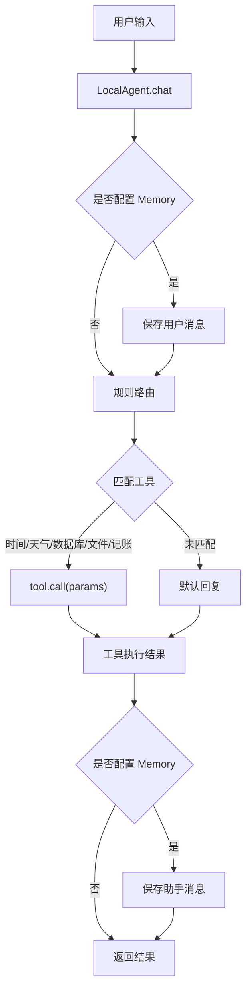
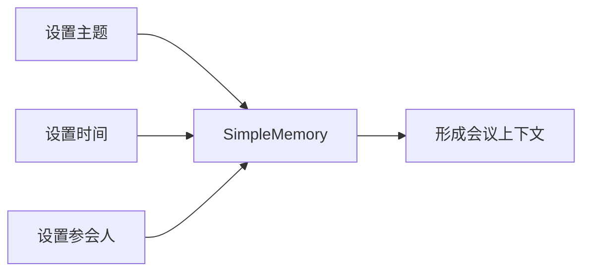
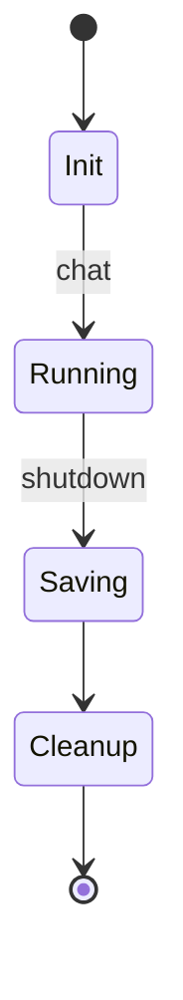
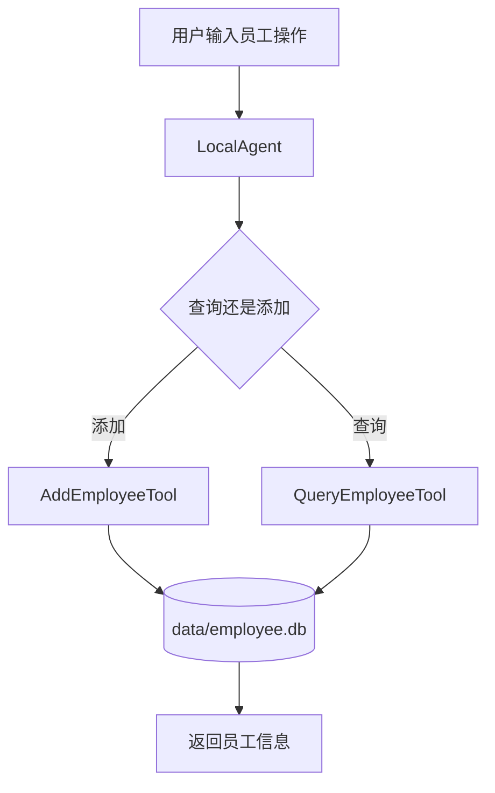
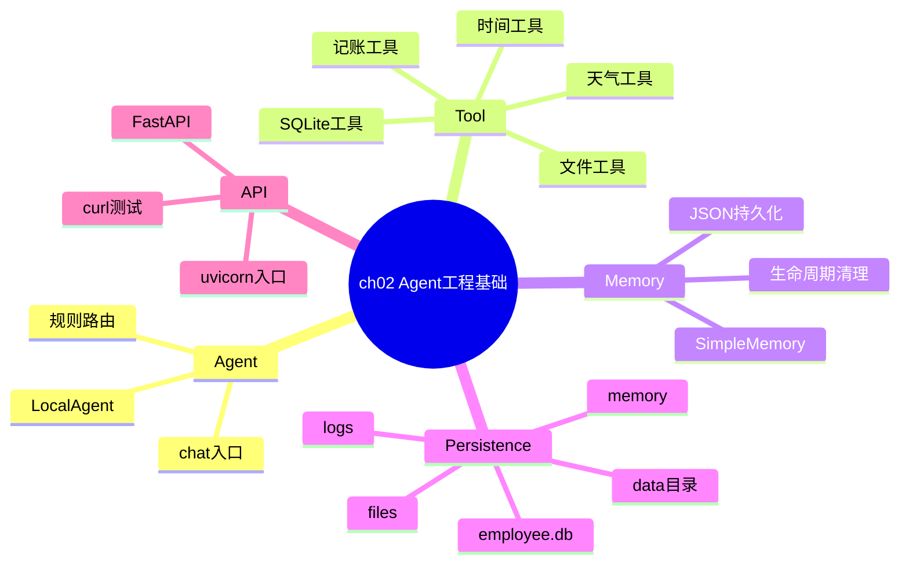

# 第2章：Agent 结构、工具、记忆与服务化

本章 `src/` 目录已经改造成不依赖 `qwen_agent` / `qwen_compat` 的本地教学版本。核心抽象统一放在 `src/agent_runtime.py`，各示例只关注 Agent、Tool、Memory、文件、SQLite 和 Web API 的运行机制。

`main.py` 保留为原始备份，不参与本章可运行示例的改造。

## 目录结构

```text
ch02/
├── data/                              # 本章所有本地持久化数据
│   ├── employee.db                    # SQLite员工数据库
│   ├── files/                         # 文件读写工具的工作目录
│   ├── logs/                          # 启动日志
│   ├── memory/                        # JSON会话记忆
│   └── memory_cleanup/                # 生命周期清理示例数据
└── src/
    ├── agent_runtime.py               # 本章Agent/Tool/Memory/路径封装
    ├── 2_1_agent_startup.py           # Agent启动、工具注册、日志
    ├── 2_2_agent_state_tracking.py    # 多轮状态追踪
    ├── 2_3_persistent_memory_agent.py # JSON持久化记忆
    ├── 2_4_gent_shutdown_cleanup.py   # Agent注销与资源清理
    ├── 2_5_agent_web_api_weather.py   # 外部Web API工具
    ├── 2_6_agent_sqlite_db.py         # SQLite数据库工具
    ├── 2_7_agent_file_exec.py         # 文件读写与代码执行工具
    ├── 2_8_agent_ui_api.py            # FastAPI记账Agent
    └── agent_ui_api.py                # uvicorn启动入口
```

## 核心封装

`agent_runtime.py` 承担三类职责：

- `BaseTool` / `Tool`：统一工具接口，工具只需要实现 `run(params)`，运行时由 `call(params)` 调用。
- `LocalAgent`：轻量规则路由器，根据用户输入选择工具，例如时间、天气、数据库、文件读写、记账。
- 路径管理：所有日志、SQLite、JSON、临时文件都写入 `ch02/data/`，避免散落到项目根目录。

```python
from agent_runtime import BaseTool, LocalAgent as Agent, data_path

class GetTimeTool(BaseTool):
    def run(self, params: dict) -> str:
        return "当前时间是：..."

agent = Agent(name="DemoAgent", tools=[GetTimeTool()])
print(agent.chat("现在几点"))
```

## 运行流程



## 数据持久化约定

本章所有本地状态统一写到：

```text
/Users/dustchen/workdir/dev_agents/projects/agent-getstarted-python/ch02/data
```

路径由 `agent_runtime.py` 管理：

```python
data_path("logs", "agent_startup.log")
memory_path("session_001.json")
cleanup_path("temp_agent_001_log.txt")
safe_workspace_path("test.txt")
```

这样做有三个好处：

- 本地日志、数据库、临时文件位置固定，便于清理和排查。
- 示例代码不会污染项目根目录。
- 文件读写工具默认限制在 `data/files/`，更适合教学和测试。

## 示例速览

| 文件 | 知识点 | 本地持久化 |
| --- | --- | --- |
| `2_1_agent_startup.py` | Agent启动、工具注册、日志 | `data/logs/agent_startup.log` |
| `2_2_agent_state_tracking.py` | 多轮状态、短期记忆 | 进程内存 |
| `2_3_persistent_memory_agent.py` | JSON会话恢复 | `data/memory/*.json` |
| `2_4_gent_shutdown_cleanup.py` | 生命周期、shutdown、清理 | `data/memory_cleanup/` |
| `2_5_agent_web_api_weather.py` | 外部API工具封装 | 无 |
| `2_6_agent_sqlite_db.py` | SQLite增改查、唯一索引 | `data/employee.db` |
| `2_7_agent_file_exec.py` | 文件读写、代码执行 | `data/files/` |
| `2_8_agent_ui_api.py` | FastAPI服务化Agent | 进程内存 |

## 例2-1：启动与工具注册

运行：

```bash
python3 ch02/src/2_1_agent_startup.py
```

知识点：

- Agent 启动时通常需要初始化工具、记忆、日志。
- `StartupCheckTool` 和 `GetTimeTool` 展示了最小工具封装。
- 日志写入 `data/logs/agent_startup.log`。

## 例2-2：状态追踪

运行：

```bash
python3 ch02/src/2_2_agent_state_tracking.py
```

这个示例模拟会议助手：设置会议主题、时间、参会人。它展示了多轮对话中如何把逐步收集的信息放入 Memory。



## 例2-3：JSON 持久化记忆

运行：

```bash
python3 ch02/src/2_3_persistent_memory_agent.py
```

`PersistentJSONMemory` 会把会话写到 `data/memory/session_id.json`。程序重新启动后，可以从 JSON 中恢复历史消息。

适合：

- 会话恢复
- 长流程任务
- 教学演示长期记忆

不适合：

- 高并发写入
- 大规模检索
- 复杂权限管理

## 例2-4：生命周期与清理

运行：

```bash
python3 ch02/src/2_4_gent_shutdown_cleanup.py
```

这个示例引入 `ManagedAgent.shutdown()`，模拟 Agent 任务完成后的资源保存与清理。



## 例2-5：Web API 工具

运行：

```bash
python3 ch02/src/2_5_agent_web_api_weather.py
```

天气工具把外部系统调用封装成 Tool。当前示例为了稳定教学，保留了简单的本地返回逻辑；真实项目中可以替换成 `requests.get(...)` 或 SDK 调用。

## 例2-6：SQLite 数据库工具

运行：

```bash
python3 ch02/src/2_6_agent_sqlite_db.py
```

数据写入：

```text
ch02/data/employee.db
```

当前实现包含：

- 首次运行自动建表。
- 初始化时清理历史重复姓名。
- `name` 字段建立唯一索引。
- 重复添加同名员工时执行更新，而不是插入重复行。



## 例2-7：文件读写与代码执行

运行：

```bash
python3 ch02/src/2_7_agent_file_exec.py
```

文件读写默认进入：

```text
ch02/data/files/
```

例如用户要求写入 `test.txt`，实际路径会是：

```text
ch02/data/files/test.txt
```

代码执行工具适合展示 Agent 调用本地能力的方式，但真实系统要增加沙箱、超时、权限控制和危险语句过滤。

## 例2-8：FastAPI 服务化 Agent

启动服务：

```bash
uvicorn agent_ui_api:app --reload --port 8080
```

如果当前终端不在 `ch02/src`，可以这样运行：

```bash
cd projects/agent-getstarted-python/ch02/src
uvicorn agent_ui_api:app --reload --port 8080
```

测试：

```bash
curl -X POST http://localhost:8080/chat \
  -H "Content-Type: application/json" \
  -d '{"session_id": "user123", "message": "刚刚买菜花了20元"}'
```

示例响应：

```json
{"session_id":"user123","reply":"已记录消费：买菜 - 20元"}
```

## 本章知识地图



## 常见坑

- `qwen_agent.tools.base.BaseTool` 新版要求实现抽象方法 `call()`，旧示例只写 `run()` 会报错。本章已改成自定义 `BaseTool`。
- `qwen_agent.Agent` 不能像早期示例那样直接实例化。本章用 `LocalAgent` 做教学版路由。
- `uvicorn 2-8.py` 不是合法 ASGI 导入字符串。现在使用 `agent_ui_api:app`。
- 本地持久化文件不要散落在项目根目录。本章统一进入 `ch02/data/`。
- `main.py` 是备份文件，仍保留旧写法；运行本章请使用 `src/` 下的新文件。

## 一键检查

```bash
python3 -m py_compile ch02/src/*.py
python3 ch02/src/2_1_agent_startup.py
python3 ch02/src/2_3_persistent_memory_agent.py
python3 ch02/src/2_6_agent_sqlite_db.py
python3 ch02/src/2_7_agent_file_exec.py
```
