# 第3章：大模型部署、微调与本地服务化

本章围绕一条完整的大模型工程链路展开：先调用云端 SaaS 大模型接口，再在 Colab GPU 上加载 Qwen3 做本地推理，随后用 LoRA 做轻量微调，最后把模型能力封装成 OpenAI 兼容的 HTTP 服务。本地 Mac 没有 CUDA GPU，所以实际推荐用 Ollama 承担本地推理服务，Colab T4 承担 Transformers 模型加载和微调实验。

## 文件地图

| 文件 | 主题 | 推荐运行环境 | 说明 |
| --- | --- | --- | --- |
| `src/3_1_openai_saas_example.py` | SaaS API 批量调用 | 本地 Mac | 通过项目根目录 `utils.py` 封装的 OpenAI 兼容客户端调用远程模型。 |
| `src/3_2_qwen3_local_deploy.py` | Transformers 本地加载模型示例 | 概念示例 | 早期示例使用 `Qwen/Qwen-235B`，普通 Mac 不适合直接跑。实际建议看 Colab notebook。 |
| `src/3_2_qwen3_colab_deploy.ipynb` | Colab 加载 Qwen3 推理 | Colab T4 | 使用 `Qwen/Qwen3-1.7B`、`AutoTokenizer`、`AutoModelForCausalLM` 做基础推理。 |
| `src/3_3_qwen3_lora_colab_finetune.py` | Qwen3 LoRA 微调 | Colab T4 | 用 PEFT LoRA 微调中文情感分类任务。 |
| `src/3_3.ipynb` | LoRA 微调 notebook | Colab T4 | 包含安装依赖、训练、加载 LoRA 权重、预测验证等单元。 |
| `src/3_4_qwen3_colab_batch_inference.py` | 批量推理与效果验证 | Colab T4 | 对多条问题做推理，统计 token 数、耗时和平均速度。 |
| `src/3_4.ipynb` | 批量推理 notebook | Colab T4 | notebook 版本，适合逐步调试和观察输出。 |
| `src/3_5_qwen3_colab_fastapi_service.py` | OpenAI 兼容 FastAPI 服务 | 本地 Mac 或 Colab | 默认走 Ollama，本地 Mac 友好；也可切换到 Colab Transformers 后端。 |
| `src/3_6_ollama_function_call_service.py` | Ollama 函数调用 | 本地 Mac | 使用 Ollama `tools` 字段，让模型选择调用天气或加法函数。 |
| `src/3_7_ollama_batch_and_stream_service.py` | 批处理与流式输出 | 本地 Mac | 对多组消息顺序调用 Ollama，并把流式响应转成 SSE。 |
| `src/3_8_ollama_chat_audit_service.py` | 输入输出审核 | 本地 Mac | 使用 Trie 敏感词树做生成前和生成后审核。 |
| `src/3_9_ollama_chat_with_confidence_proxy.py` | 生成质量指标 | 本地 Mac | Ollama 不返回 logits，因此用耗时、token 数、结束原因做近似质量提示。 |

## 整体链路

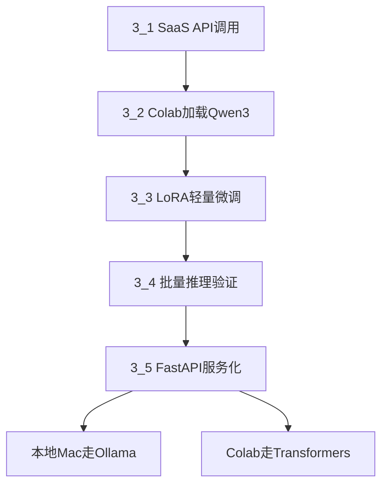

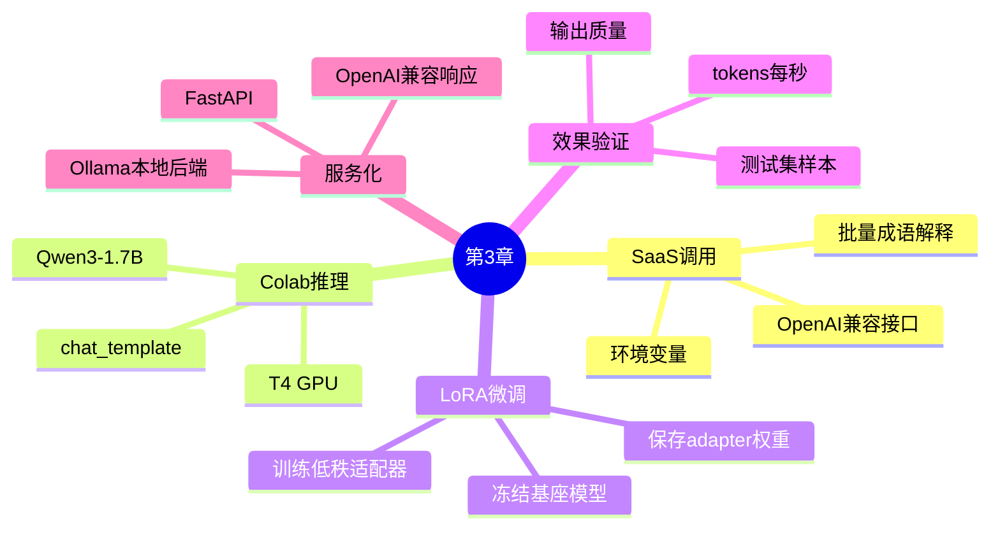

## 3_1：云端 SaaS 大模型调用

`3_1_openai_saas_example.py` 演示的是最轻量的大模型接入方式：不在本地加载模型，只把 prompt 发给远程模型服务。

核心流程：

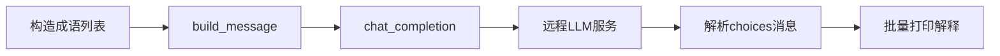

代码中不再直接使用旧版 `openai.ChatCompletion`，而是通过项目根目录的 `utils.py` 统一封装。这一点很重要，因为 `openai>=1.0.0` 之后旧接口已经废弃，当前项目使用的是新版 OpenAI Python SDK 风格。

运行：

```bash
cd /Users/dustchen/workdir/dev_agents/projects/agent-getstarted-python
python3 ch03/src/3_1_openai_saas_example.py
```

适合场景：

- 快速验证 prompt 和模型能力。
- 不想管理显存、模型文件和推理服务。
- 可以接受网络调用、API Key、调用成本和服务商限制。

## 3_2：Qwen3 模型加载与本地推理

`3_2_qwen3_local_deploy.py` 是一个 Transformers 加载模型的概念示例，但里面的 `Qwen/Qwen-235B` 对普通本地环境极不友好。MacBook Air M3 即使有 24GB 内存，也不适合直接用 Transformers 加载这种超大模型。

实际可运行路径是 `3_2_qwen3_colab_deploy.ipynb`：

```python
from transformers import AutoTokenizer, AutoModelForCausalLM
import torch

model_id = "Qwen/Qwen3-1.7B"

tokenizer = AutoTokenizer.from_pretrained(model_id)
model = AutoModelForCausalLM.from_pretrained(
    model_id,
    device_map="auto",
    dtype=torch.float16,
)
model.eval()
```

推理时使用 Qwen3 的 chat template：

```python
inputs = tokenizer.apply_chat_template(
    messages,
    add_generation_prompt=True,
    tokenize=True,
    return_dict=True,
    return_tensors="pt",
).to(model.device)
```

这里的关键点是：聊天模型不是简单把字符串丢给 tokenizer，而是要按模型训练时的对话格式组织 `system/user/assistant` 消息。`apply_chat_template` 会把消息转成模型熟悉的 token 序列。

## 3_3：LoRA 微调技术原理

`3_3.py` 和 `3_3.ipynb` 使用 PEFT 的 LoRA 对 `Qwen/Qwen3-1.7B` 做中文情感分类微调。训练数据很小，主要用于理解流程，不是为了训练一个生产级分类器。

LoRA 的核心思想：

- 大模型原始权重 `W` 保持冻结，不做全量更新。
- 在目标线性层旁边增加两个小矩阵 `A` 和 `B`。
- 训练时只更新 `A` 和 `B`，让模型学到一个增量 `Delta W = B * A`。
- 推理时等价于使用 `W + Delta W`。

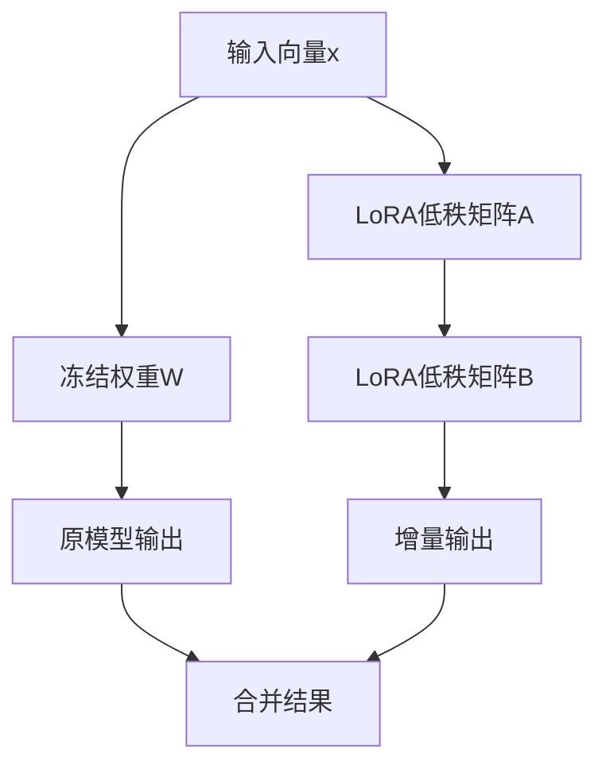

为什么 LoRA 适合 Colab T4：

- 只训练少量 adapter 参数，显存压力小。
- 基座模型保持冻结，训练速度更快。
- 输出目录只保存 LoRA 权重，不需要保存完整模型。
- 适合教学、领域适配、分类格式对齐、风格微调等轻量任务。

本章 LoRA 配置要点：

```python
LoraConfig(
    task_type=TaskType.CAUSAL_LM,
    r=8,
    lora_alpha=16,
    lora_dropout=0.05,
    bias="none",
    target_modules=[
        "q_proj", "k_proj", "v_proj", "o_proj",
        "gate_proj", "up_proj", "down_proj",
    ],
)
```

参数含义：

| 参数 | 含义 | 影响 |
| --- | --- | --- |
| `r` | 低秩矩阵的秩 | 越大可训练能力越强，但显存和训练成本更高。 |
| `lora_alpha` | LoRA 缩放系数 | 控制 adapter 对原模型输出的影响强度。 |
| `lora_dropout` | dropout 比例 | 小数据训练时可减轻过拟合。 |
| `target_modules` | 注入 LoRA 的层 | 本例覆盖注意力层和 MLP 层，适配能力更强。 |

训练流程：

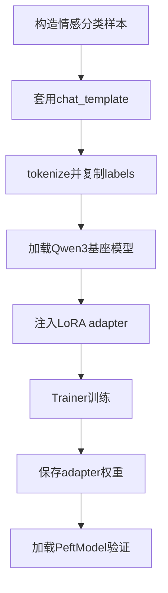

## 3_4：批量推理与效果验证

微调完成后，不应该只看一条输出。`3_4.py` 增加了更像工程验证的批量测试：

- 准备多条问题。
- 逐条推理。
- 记录生成 token 数。
- 记录耗时。
- 计算 tokens/s。
- 检查输出是否为空、是否过短、是否包含异常文本。

这类验证虽然简单，但很实用。它能快速回答几个问题：

- 模型是否真的能生成非空答案。
- 回答长度是否符合预期。
- 速度是否可接受。
- 多个问题上是否有明显崩坏。
- 修改 `max_new_tokens`、`temperature`、`do_sample` 后质量和耗时如何变化。

推理参数经验：

| 参数 | 建议 |
| --- | --- |
| `do_sample=False` | 更稳定，适合验证和分类任务。 |
| `temperature=0.7` | 更开放，适合问答和解释。 |
| `max_new_tokens` | 太小会截断，太大会增加等待时间。 |
| `torch.cuda.empty_cache()` | 批量测试中可缓解显存碎片压力。 |

## 3_5：FastAPI 服务化与 Ollama 后端

`3_5.py` 把模型能力封装成 OpenAI 兼容接口：

```text
POST /v1/chat/completions
```

返回格式类似：

```json
{
  "id": "chatcmpl-local-qwen3",
  "object": "chat.completion",
  "model": "qwen3:1.7b",
  "choices": [
    {
      "index": 0,
      "message": {
        "role": "assistant",
        "content": "..."
      },
      "finish_reason": "stop"
    }
  ]
}
```

后端选择：

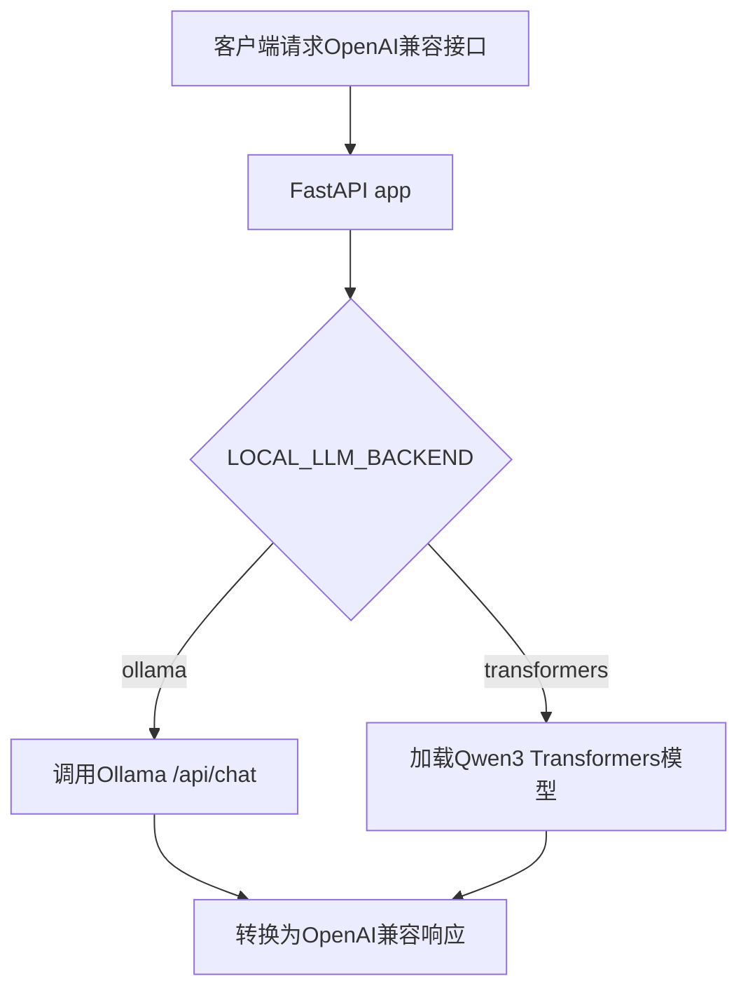

本地 Mac 推荐 Ollama：

```bash
cd /Users/dustchen/workdir/dev_agents/projects/agent-getstarted-python
ollama pull qwen3:1.7b
LOCAL_LLM_BACKEND=ollama OLLAMA_MODEL=qwen3:1.7b python3 ch03/src/3_5.py
```

测试：

```bash
curl -X POST http://127.0.0.1:8080/v1/chat/completions \
  -H "Content-Type: application/json" \
  -d '{
    "messages": [
      {"role": "system", "content": "你是一名专业中文技术助手。"},
      {"role": "user", "content": "请解释一下LoRA技术的基本原理"}
    ],
    "temperature": 0.7,
    "max_tokens": 1200
  }'
```

Colab Transformers 后端：

```python
import os
os.environ["LOCAL_LLM_BACKEND"] = "transformers"
```

Notebook 中不要直接调用 `uvicorn.run(app, ...)`，因为 Jupyter/Colab 已经有事件循环，可能报：

```text
asyncio.run() cannot be called from a running event loop
```

推荐在 notebook 中使用：

```python
notebook_test()
```

或者：

```python
server_thread = start_colab_server(port=8080)
```

## 本章踩坑记录

| 问题 | 现象 | 原因 | 处理 |
| --- | --- | --- | --- |
| OpenAI 旧接口废弃 | `openai.ChatCompletion` 不可用 | `openai>=1.0.0` 改了 SDK API | 使用项目 `utils.py` 封装的新接口。 |
| Mac 无 CUDA | Transformers 本地加载报 GPU 问题 | Apple Silicon 不是 CUDA GPU | 微调放到 Colab T4，本地推理走 Ollama。 |
| Colab `torchvision::nms` 报错 | 导入 Qwen3 模型失败 | Colab 自带 `torchvision` 与当前 `torch` 组合冲突 | `!pip uninstall -y torchvision` 后重启 Runtime。 |
| Colab `torchao` 版本不兼容 | PEFT 导入时报 `torchao` 版本过旧 | 预装 `torchao` 与 PEFT 要求不匹配 | `!pip uninstall -y torchao` 后重启 Runtime。 |
| Hugging Face Token 警告 | 提示 `HF_TOKEN` 不存在 | 未登录 Hugging Face | 公共模型可继续下载；设置 token 可提升稳定性和限额。 |
| Homebrew Ollama 缺文件 | `llama-server binary not found` | Homebrew bottle 中缺推理后端文件 | 换官网 Mac App 或重新安装完整 Ollama。 |
| Ollama 端口占用 | `address already in use` | 11434 已有 Ollama 服务在运行 | 不需要重复 `ollama serve`，直接请求已有服务。 |
| Qwen3 输出为空 | HTTP 200 但 `content` 是空字符串 | thinking 模式占满 token，最终答案未生成 | `3_5.py` 默认设置 `think:false`；或提高 `max_tokens`。 |
| `max_tokens` 太小 | 回答截断或只有思考内容 | 生成预算不足 | 本地 Ollama 测试可设为 `1200`，等待时间会变长。 |

## 本地 Mac 与 Colab 的分工建议

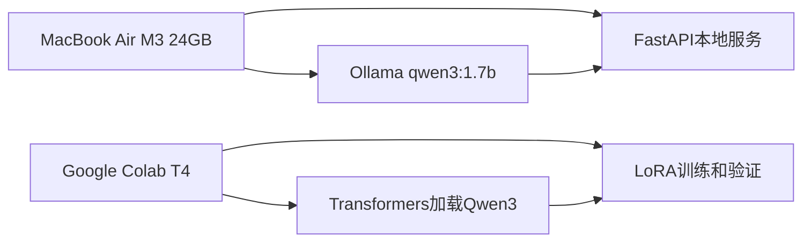

建议策略：

- Mac 本地：适合跑 Ollama、FastAPI 服务、curl/API 测试、Agent 应用集成。
- Colab T4：适合跑 Transformers、LoRA 微调、批量推理和显存实验。
- MLX：对 M 系列芯片优化好，但 API 和模型格式转换门槛更高；本章暂时不作为主线。
- Ollama：牺牲一些底层可控性，换来模型下载、量化格式、服务 API 的便利。

## 微调效果如何继续改进

当前 `3_3.py` 的训练集只有 6 条样本，主要用于跑通流程。要真正提升效果，可以从这些方向继续做：

1. 扩充训练数据：每个类别至少几十到几百条，覆盖更多表达方式。
2. 划分验证集：不要只用训练样本验证，准备模型没见过的新句子。
3. 固定输出格式：例如只允许回答 `正面` 或 `负面`，减少解释性文本。
4. 调整 LoRA 参数：尝试 `r=16`、`lora_alpha=32`，观察效果和显存变化。
5. 控制训练轮数：小数据容易过拟合，增加样本比单纯增加 epoch 更有效。
6. 做错误分析：记录错分样本，补充相似表达到训练集。

一个简单验证集可以长这样：

```python
tests = [
    ("客服很耐心，问题当天解决", "正面"),
    ("电池掉电太快，体验很差", "负面"),
    ("包装完整，送货速度也不错", "正面"),
    ("用了两天就频繁卡死", "负面"),
]
```

## 3_6 到 3_9：Ollama 本地服务进阶

前面的 `3_5` 把本地模型封装成 OpenAI 兼容聊天接口。`3_6` 到 `3_9` 继续往工程化方向走：工具调用、批处理、流式输出、内容审核、生成质量指标。这些功能都不再依赖 CUDA，也不需要在 Mac 上用 Transformers 直接加载模型，而是统一调用本地 Ollama 服务：

```text
http://127.0.0.1:11434/api/chat
```

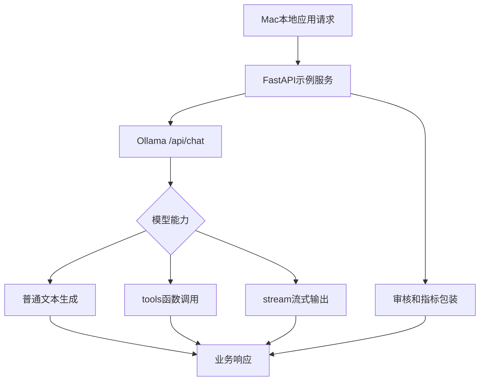

### 3_6：函数调用 Function Calling

文件：`src/3_6_ollama_function_call_service.py`

这个示例演示 Ollama 的 `tools` 参数。服务会把可调用函数描述发给模型，模型不直接回答，而是返回 `tool_calls`，例如：

```json
{
  "tool_calls": [
    {
      "function": {
        "name": "get_weather",
        "arguments": {
          "city": "北京"
        }
      }
    }
  ]
}
```

代码中注册了两个工具：

| 工具 | 功能 |
| --- | --- |
| `get_weather(city)` | 模拟查询城市天气。 |
| `calculate_sum(a, b)` | 计算两个数字之和。 |

流程：

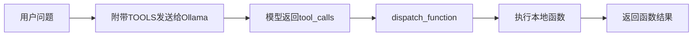

启动：

```bash
OLLAMA_MODEL=gemma4:e2b-mlx python3 ch03/src/3_6_ollama_function_call_service.py
```

测试：

```bash
curl -X POST http://127.0.0.1:8081/v1/chat/function_call \
  -H "Content-Type: application/json" \
  -d '{"messages":[{"role":"user","content":"请告诉我北京的天气"}]}'
```

注意：function calling 不是模型真的访问了天气 API，而是模型判断“应该调用哪个函数、参数是什么”。真正的数据来自服务端本地的 `get_weather`。

### 3_7：批处理与流式输出

文件：`src/3_7_ollama_batch_and_stream_service.py`

这个示例保留两个接口：

| 接口 | 功能 |
| --- | --- |
| `/v1/chat/batch` | 一次请求中提交多组对话，服务端逐条调用 Ollama。 |
| `/v1/chat/stream` | 使用 Ollama 原生 `stream=true`，转换为 SSE 风格流式输出。 |

批处理适合离线评测、批量摘要、批量问答。流式输出适合前端聊天界面，因为用户不用等完整答案生成完才看到内容。

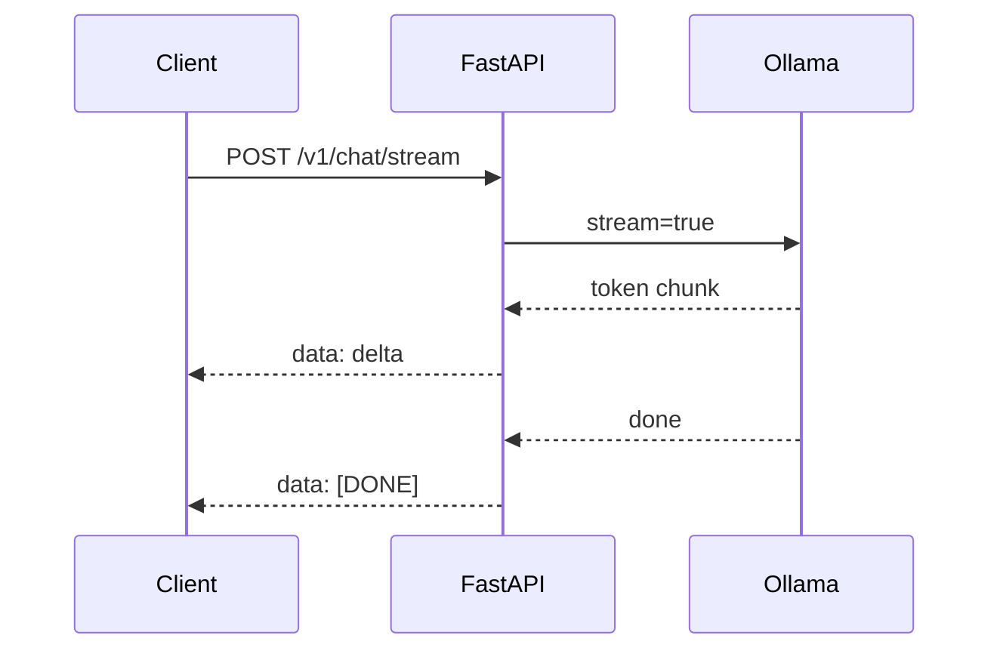

启动：

```bash
OLLAMA_MODEL=gemma4:e2b-mlx python3 ch03/src/3_7_ollama_batch_and_stream_service.py
```

批处理测试：

```bash
curl -X POST http://127.0.0.1:8082/v1/chat/batch \
  -H "Content-Type: application/json" \
  -d '{"messages_list":[[{"role":"user","content":"介绍一下LangChain"}],[{"role":"user","content":"什么是LoRA技术？"}]],"max_tokens":256}'
```

流式测试：

```bash
curl -N -X POST http://127.0.0.1:8082/v1/chat/stream \
  -H "Content-Type: application/json" \
  -d '{"messages":[{"role":"user","content":"请解释一下大语言模型的上下文窗口"}],"max_tokens":256}'
```

这里踩过一个重要坑：`gemma4:e2b-mlx` 和 `qwen3:1.7b` 都可能默认先输出 thinking，导致 `message.content` 为空，流式接口只返回 `[DONE]`。因此示例中统一加入：

```json
"think": false
```

### 3_8：输入输出审核

文件：`src/3_8_ollama_chat_audit_service.py`

这个示例展示一个最小可用的审核流程：

1. 生成前检查用户输入。
2. 未命中敏感词时调用 Ollama。
3. 生成后检查模型输出。
4. 命中则返回阻断信息，未命中则返回回答。

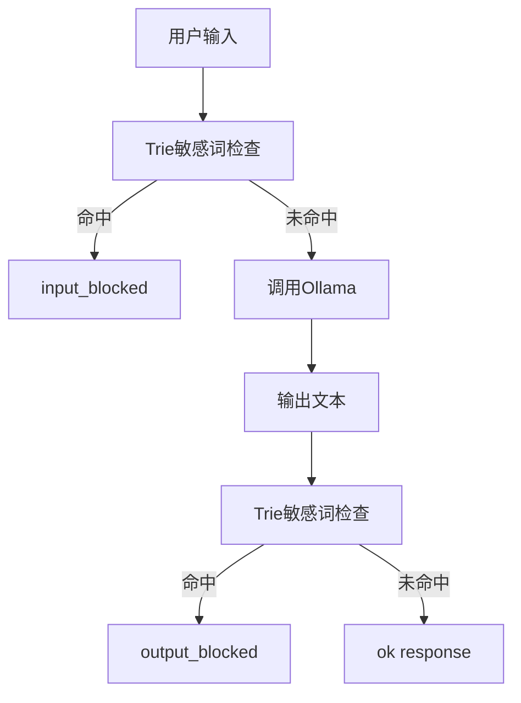

Trie 树适合做固定词表的快速匹配，优点是实现简单、速度快；局限是无法理解语义变体、谐音、隐晦表达，也不能替代真正的安全审核模型。

启动：

```bash
OLLAMA_MODEL=gemma4:e2b-mlx PORT=8083 python3 ch03/src/3_8_ollama_chat_audit_service.py
```

测试拦截：

```bash
curl -X POST http://127.0.0.1:8083/v1/chat/audit \
  -H "Content-Type: application/json" \
  -d '{"messages":[{"role":"user","content":"请告诉我关于毒品的知识"}]}'
```

### 3_9：生成质量与置信度近似

文件：`src/3_9_ollama_chat_with_confidence_proxy.py`

原 Transformers 版本可以通过 `return_dict_in_generate=True` 和 `output_scores=True` 拿到每一步 token 的 logits，再计算 top-k token 概率。Ollama 的 `/api/chat` 不返回 logits，所以本示例没有伪造“真实置信度”，而是返回可观测的生成质量指标：

| 字段 | 含义 |
| --- | --- |
| `done_reason` | 模型停止原因，常见是 `stop` 或 `length`。 |
| `prompt_eval_count` | prompt token 数。 |
| `eval_count` | 生成 token 数。 |
| `eval_duration_ns` | 生成阶段耗时，单位纳秒。 |
| `tokens_per_second` | 近似生成速度。 |
| `confidence_proxy` | 基于结束原因和生成长度的质量提示，不是真实概率。 |

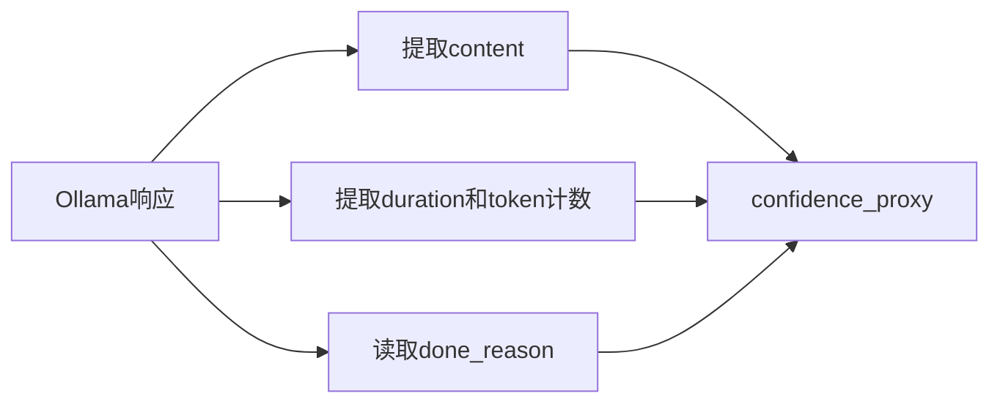

启动：

```bash
OLLAMA_MODEL=gemma4:e2b-mlx PORT=8084 python3 ch03/src/3_9_ollama_chat_with_confidence_proxy.py
```

测试：

```bash
curl -X POST http://127.0.0.1:8084/v1/chat/with_confidence \
  -H "Content-Type: application/json" \
  -d '{"messages":[{"role":"user","content":"请解释一下LangChain的核心组件"}],"max_tokens":256}'
```

## Mac M3 本地模型适配估算

你的机器是 Apple M3，10 核 Apple GPU，24GB 统一内存。它不是 NVIDIA 显卡，所以不能使用 CUDA，也不能用 `nvidia-smi`。Apple Silicon 的 GPU 计算主要通过 Metal、MPS、MLX 或 Ollama 的本地后端间接使用。

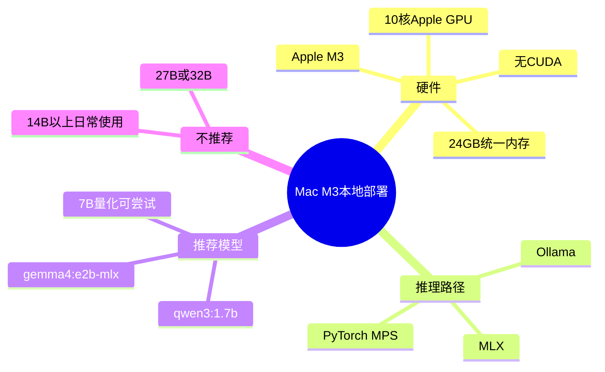

统一内存和传统显存不同。你的 GPU 没有固定的 8GB 或 12GB 独立显存，而是和 CPU 共享整机 24GB 内存。实际能给模型使用的空间会受到系统、浏览器、IDE、Python、Ollama、上下文长度和 KV Cache 的共同影响。

| 模型级别 | 本机适配建议 |
| --- | --- |
| 1B 到 2B | 很稳，适合日常开发和接口测试。 |
| 4B 到 5B | 推荐尝试，`gemma4:e2b-mlx` 当前大小约 7.1GB，能跑但比 `qwen3:1.7b` 更慢。 |
| 7B 到 8B Q4 | 可以尝试，注意内存压力和发热。 |
| 14B Q4 | 可能能跑，但 MacBook Air 无风扇，长时间使用体验一般。 |
| 27B 以上 | 不建议作为本章本地开发主力。 |

当前本地模型：

```text
qwen3:1.7b        1.4 GB
gemma4:e2b-mlx    7.1 GB
```

简单选择：

- 快速接口测试：优先 `qwen3:1.7b`。
- 工具调用、长一点的中文解释：优先 `gemma4:e2b-mlx`。
- 想要更快响应：降低 `max_tokens`，例如 `256`。
- 想要更完整回答：提高 `max_tokens`，例如 `800` 或 `1200`，等待时间会变长。

## Ollama、MLX 与 MPS 的取舍

| 路径 | 优点 | 局限 | 本章建议 |
| --- | --- | --- | --- |
| Ollama | 安装简单，模型管理方便，自带 HTTP API，适合服务化 | 底层 logits、训练、细粒度控制较少 | 本地 Mac 主推 |
| MLX | Apple Silicon 优化好，适合 M 系列芯片 | API 和模型格式转换门槛更高 | 后续进阶再深入 |
| PyTorch MPS | PyTorch 生态内可用 Apple GPU | 大模型训练兼容性不如 CUDA，很多脚本仍优先 CUDA | 小模型实验可以用 |
| Colab CUDA | 生态成熟，适合 Transformers 和 LoRA | 依赖云端环境，断线和版本冲突常见 | 微调和显存实验主推 |

本章最后采用的路线是：

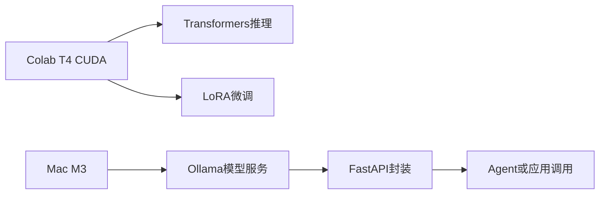

## Ollama 本地测试踩坑补充

| 问题 | 现象 | 原因 | 处理 |
| --- | --- | --- | --- |
| Homebrew 版 Ollama 缺文件 | `llama-server binary not found` | 安装包缺推理后端文件 | 换官网 Mac App 或重新安装完整版本。 |
| 端口已占用 | `address already in use` | `11434` 已有 Ollama 服务 | 不要重复 `ollama serve`，直接请求现有服务。 |
| 服务能列模型但不能推理 | `/api/tags` 正常，`/api/chat` 报错 | 模型列表和推理后端是两回事 | 用 `/api/chat` 单独验证。 |
| 输出为空 | `content` 是空字符串 | 模型先输出 `thinking`，最终回答未生成 | 请求中加入 `"think": false`。 |
| 只返回 `[DONE]` | 流式接口没有内容片段 | thinking 内容没有作为 `content` 流出 | 同样设置 `"think": false`。 |
| 回答被截断 | `done_reason` 是 `length` | `max_tokens` 太小 | 调大到 `800` 或 `1200`。 |
| curl 命令报 422 | FastAPI 参数校验失败 | JSON 缺字段或 shell 换行写错 | 检查 `Content-Type` 和请求体结构。 |
| 响应慢 | 等待时间明显变长 | 模型更大或 `max_tokens` 更高 | 用 `qwen3:1.7b` 做快速调试，用 Gemma 做质量测试。 |

## 小结

本章真正想建立的是一个工程判断：大模型不是只有“调用 API”或“训练模型”两种选择。实际项目中常常要根据设备、成本、延迟、可控性和维护复杂度组合方案。

- 想快速做功能：先用 SaaS API。
- 想理解模型推理：在 Colab 加载 Qwen3。
- 想做领域适配：用 LoRA 微调 adapter。
- 想验证稳定性：做批量推理和指标记录。
- 想在本地集成应用：用 Ollama 加 FastAPI 封装 OpenAI 兼容接口。
- 想做更像应用的能力：继续叠加 function calling、stream、audit 和 generation stats。
