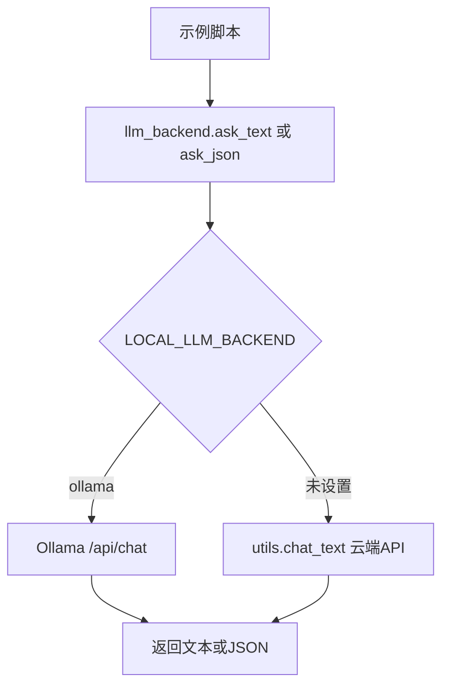
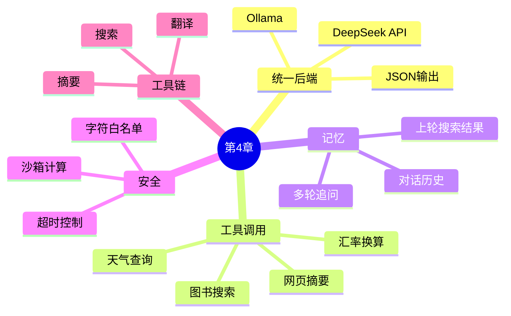
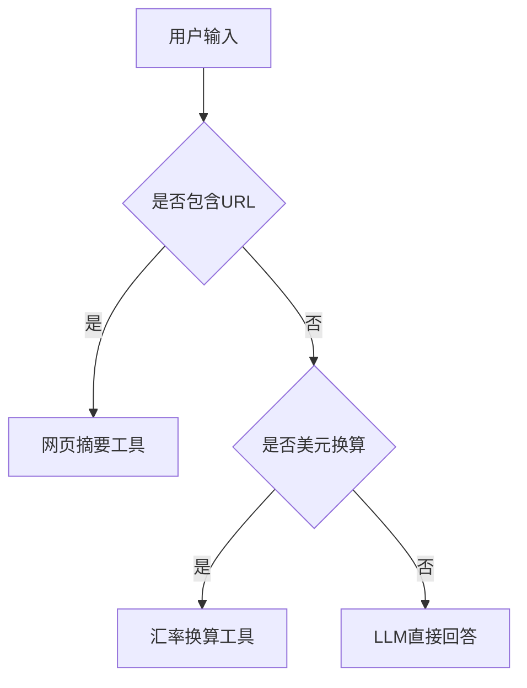
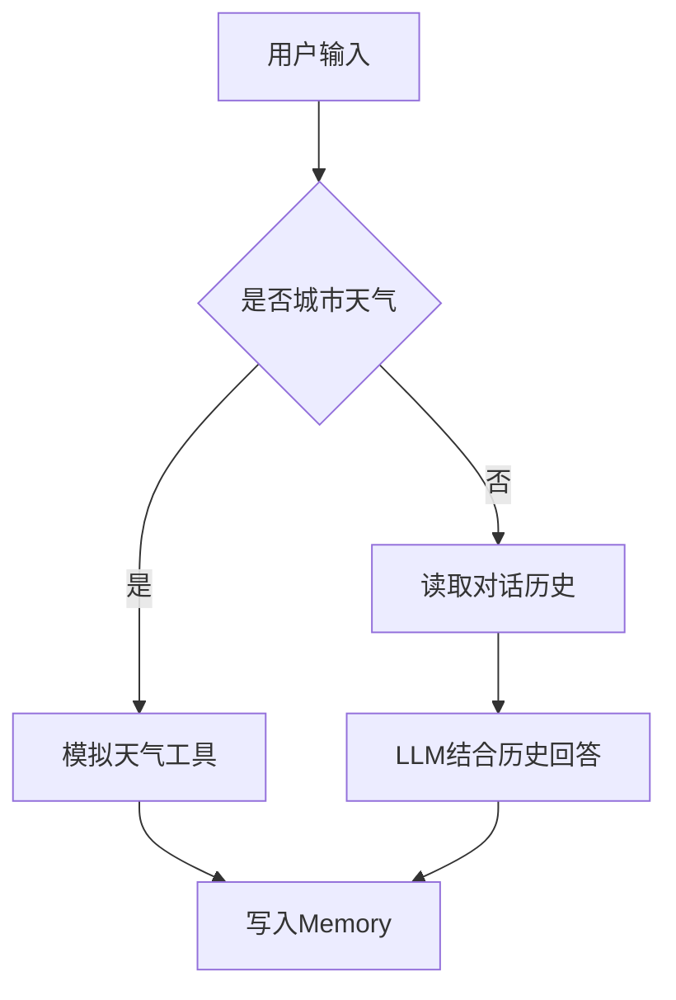
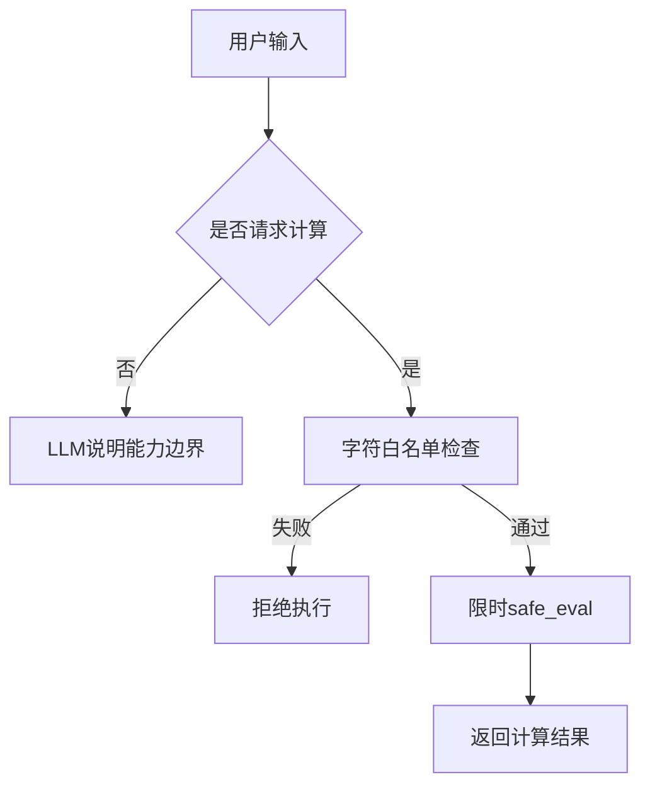
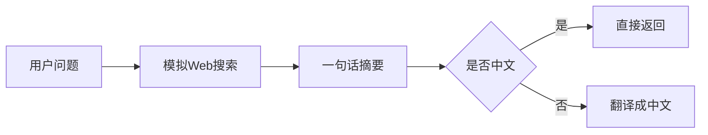
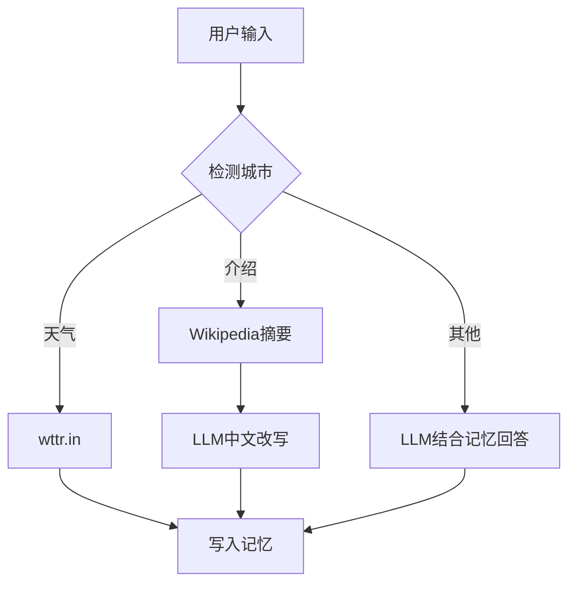
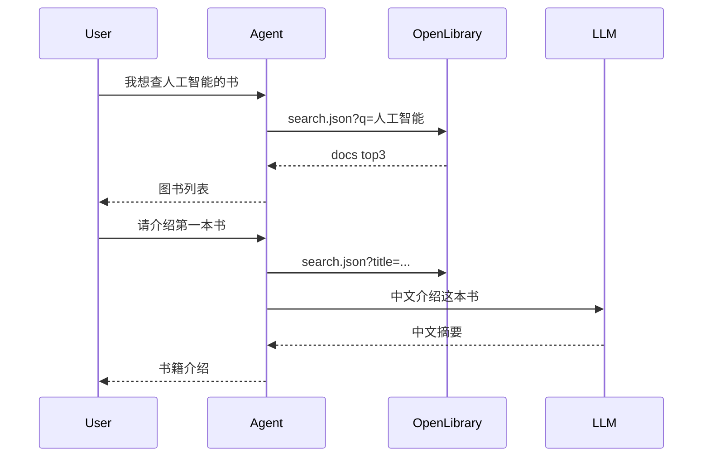

# 第4章：工具型 Agent、记忆与安全执行

本章围绕“让大模型调用工具并完成多步骤任务”展开。当前 `src` 下的示例已经统一支持两类 LLM 后端：

- 本地 Ollama，例如 `gemma4:e2b-mlx`
- 云端 DeepSeek/OpenAI 兼容 API，通过项目根目录 `utils.py` 调用

本章没有修改任何 `main.py`，所有可运行示例都在 `src` 目录。

## 文件地图

| 文件 | 主题 | 核心知识点 |
| --- | --- | --- |
| `src/llm_backend.py` | 统一 LLM 后端 | `ask_text`、`ask_json`、Ollama `think:false`、云端 API 兼容 |
| `src/4_1_research_chain.py` | 研究选题链 | PromptTemplate、多步骤链、JSON 结构化输出、局部文本生成 |
| `src/4_2_tool_agent_web_summary_currency.py` | 工具型 Agent | 工具路由、网页文本抽取、网页摘要、货币换算 |
| `src/4_3_memory_travel_agent.py` | 短期记忆 Agent | ConversationBufferMemory、天气工具、多轮上下文 |
| `src/4_4_safe_calculator_agent.py` | 安全工具执行 | 四则运算沙箱、超时控制、拒绝危险表达式 |
| `src/4_5_search_summary_translate_agent.py` | 工具链组合 | 模拟搜索、摘要、翻译、链式工具调用 |
| `src/4_6_city_weather_memory_agent.py` | 外部 HTTP 工具 | wttr.in、Wikipedia API、城市信息、记忆问答 |
| `src/4_7_book_search_memory_agent.py` | 搜索结果记忆 | OpenLibrary、跨轮追问、上一轮结果复用 |

## 统一后端

`src/llm_backend.py` 是本章的统一模型入口。各示例不再直接关心“用 Ollama 还是云端 API”，只调用：

```python
from llm_backend import ask_text, ask_json, backend_name
```



本地 Ollama 运行：

```bash
cd /Users/dustchen/workdir/dev_agents/projects/agent-getstarted-python
LOCAL_LLM_BACKEND=ollama OLLAMA_MODEL=gemma4:e2b-mlx python3 ch04/src/4_1_research_chain.py
```

云端 DeepSeek/OpenAI 兼容 API 运行：

```bash
cd /Users/dustchen/workdir/dev_agents/projects/agent-getstarted-python
python3 ch04/src/4_1_research_chain.py
```

Ollama 请求中默认设置：

```json
{
  "think": false
}
```

这样可以避免 Gemma/Qwen3 先输出 thinking，导致 `content` 为空或 JSON 不完整。

## 知识结构



## 例4-1：研究选题链

文件：`src/4_1_research_chain.py`

这个示例演示一个三步研究选题链：

1. 根据主题生成 3 个细分研究方向。
2. 为每个方向生成 1 个研究问题。
3. 为每个研究问题总结社会价值。


关键点：

- 使用 `PromptTemplate` 管理提示词。
- 前两步使用 `ask_json` 获取结构化数据。
- 第三步逐条调用 `ask_text`，再由 Python 组装结构，避免本地模型偶发输出不完整 JSON。
- 本地 Ollama 和云端 API 都能运行。

运行：

```bash
LOCAL_LLM_BACKEND=ollama OLLAMA_MODEL=gemma4:e2b-mlx python3 ch04/src/4_1_research_chain.py
```

## 例4-2：网页摘要与货币换算 Agent

文件：`src/4_2_tool_agent_web_summary_currency.py`

这个示例是一个轻量级工具型 Agent：

- 用户输入包含 URL：调用网页摘要工具。
- 用户输入包含美元金额并要求换算：调用汇率换算工具。
- 其他问题：交给 LLM 直接回答。



网页摘要流程：

1. 用 `requests.get()` 请求网页。
2. 设置浏览器风格 `User-Agent`。
3. 根据 `resp.encoding` 和 `resp.apparent_encoding` 处理中文编码。
4. 用 `HTMLParser` 提取标题、SEO description 和正文文本节点。
5. 跳过 `script`、`style`、`noscript`、`svg`。
6. 截取前 `3000` 字交给 LLM 生成 120 字内摘要。
7. LLM 失败时回退为返回前 300 字干净文本。

适合：

- SSR/SSG 页面
- 传统服务端渲染页面
- SEO 信息完整的官网、商品页、文章页

不适合：

- 纯前端 CSR 页面
- 需要登录或验证码的页面
- 图片、视频、canvas 内容
- JavaScript 执行后才出现的正文

运行：

```bash
LOCAL_LLM_BACKEND=ollama OLLAMA_MODEL=gemma4:e2b-mlx python3 ch04/src/4_2_tool_agent_web_summary_currency.py
```

## 例4-3：带记忆的旅行建议 Agent

文件：`src/4_3_memory_travel_agent.py`

这个示例实现了一个简化版 `ConversationBufferMemory`：

```python
messages = [
    {"role": "user", "content": "..."},
    {"role": "assistant", "content": "..."}
]
```

流程：



知识点：

- 记忆不是模型自动拥有的，需要显式保存并重新放入 prompt。
- 天气工具返回确定性信息，避免让模型编造天气。
- 后续“那广州呢？”这类省略表达依赖历史上下文和工具路由。

运行：

```bash
LOCAL_LLM_BACKEND=ollama OLLAMA_MODEL=gemma4:e2b-mlx python3 ch04/src/4_3_memory_travel_agent.py
```

## 例4-4：安全计算沙箱

文件：`src/4_4_safe_calculator_agent.py`

这个示例演示“工具执行必须加安全边界”。

安全措施：

- 只允许字符：`0123456789+-*/(). `
- 使用 `eval(expression, {"__builtins__": {}})` 禁用内建对象。
- 使用 `signal.alarm(3)` 限制执行时间。
- 非四则运算请求交给 LLM 做简短说明。



注意：这个示例只用于教学。生产环境应优先使用表达式解析器，例如 `ast` 或专门的数学表达式库，而不是直接 `eval`。

运行：

```bash
LOCAL_LLM_BACKEND=ollama OLLAMA_MODEL=gemma4:e2b-mlx python3 ch04/src/4_4_safe_calculator_agent.py
```

## 例4-5：搜索、摘要、翻译工具链

文件：`src/4_5_search_summary_translate_agent.py`

这个示例演示多工具顺序组合：



知识点：

- 工具链可以是固定流程，不一定每步都让模型规划。
- 搜索结果是确定性工具输出。
- 摘要和翻译是 LLM 擅长的语言转换任务。

运行：

```bash
LOCAL_LLM_BACKEND=ollama OLLAMA_MODEL=gemma4:e2b-mlx python3 ch04/src/4_5_search_summary_translate_agent.py
```

## 例4-6：城市天气、百科与对话记忆

文件：`src/4_6_city_weather_memory_agent.py`

这个示例接入两个外部 HTTP 工具：

| 工具 | 来源 | 用途 |
| --- | --- | --- |
| `get_weather` | `wttr.in` | 查询城市天气 |
| `get_city_intro` | Wikipedia REST API | 查询城市简介 |



知识点：

- LLM 不一定直接知道实时天气，实时信息应交给工具。
- 外部 API 返回的英文内容可交给 LLM 做中文摘要。
- `ConversationMemory` 保存历史，便于多轮问答。

运行：

```bash
LOCAL_LLM_BACKEND=ollama OLLAMA_MODEL=gemma4:e2b-mlx python3 ch04/src/4_6_city_weather_memory_agent.py
```

## 例4-7：图书搜索与跨轮记忆

文件：`src/4_7_book_search_memory_agent.py`

这个示例演示“上一轮工具结果”的复用：

1. 用户搜索“人工智能”的书。
2. 工具调用 OpenLibrary 返回前三本。
3. Agent 把搜索结果存在 `BookMemory.last_books`。
4. 用户追问“第一本书”，Agent 根据上一轮结果查详情。
5. LLM 用中文介绍图书信息。



知识点：

- 记忆不只保存对话文本，也可以保存结构化工具结果。
- “第一本书”这种指代必须依赖上一轮状态。
- 工具返回的数据通常需要 LLM 做面向用户的表达整理。

运行：

```bash
LOCAL_LLM_BACKEND=ollama OLLAMA_MODEL=gemma4:e2b-mlx python3 ch04/src/4_7_book_search_memory_agent.py
```

## 运行命令汇总

本地 Ollama：

```bash
LOCAL_LLM_BACKEND=ollama OLLAMA_MODEL=gemma4:e2b-mlx python3 ch04/src/4_1_research_chain.py
LOCAL_LLM_BACKEND=ollama OLLAMA_MODEL=gemma4:e2b-mlx python3 ch04/src/4_2_tool_agent_web_summary_currency.py
LOCAL_LLM_BACKEND=ollama OLLAMA_MODEL=gemma4:e2b-mlx python3 ch04/src/4_3_memory_travel_agent.py
LOCAL_LLM_BACKEND=ollama OLLAMA_MODEL=gemma4:e2b-mlx python3 ch04/src/4_4_safe_calculator_agent.py
LOCAL_LLM_BACKEND=ollama OLLAMA_MODEL=gemma4:e2b-mlx python3 ch04/src/4_5_search_summary_translate_agent.py
LOCAL_LLM_BACKEND=ollama OLLAMA_MODEL=gemma4:e2b-mlx python3 ch04/src/4_6_city_weather_memory_agent.py
LOCAL_LLM_BACKEND=ollama OLLAMA_MODEL=gemma4:e2b-mlx python3 ch04/src/4_7_book_search_memory_agent.py
```

云端 API：

```bash
python3 ch04/src/4_1_research_chain.py
python3 ch04/src/4_2_tool_agent_web_summary_currency.py
python3 ch04/src/4_3_memory_travel_agent.py
python3 ch04/src/4_4_safe_calculator_agent.py
python3 ch04/src/4_5_search_summary_translate_agent.py
python3 ch04/src/4_6_city_weather_memory_agent.py
python3 ch04/src/4_7_book_search_memory_agent.py
```

## 本章踩坑与经验

| 问题 | 现象 | 处理 |
| --- | --- | --- |
| 本地模型输出 thinking | `content` 为空或 JSON 不完整 | Ollama 请求统一设置 `think:false` |
| JSON 输出偶发不合法 | Gemma 少闭合引号或括号 | 关键步骤用 `ask_json`，复杂步骤改成逐条文本生成后 Python 组装 |
| 网页摘要乱码 | 页面中文变成乱码 | 使用 `resp.apparent_encoding` 和 `errors="replace"` 解码 |
| 网页摘要混入菜单 | 导航、页脚进入摘要 | 截断文本并过滤 script/style，必要时升级到 Playwright |
| 外部 API 慢或失败 | 天气、Wikipedia、OpenLibrary 请求超时 | 工具函数捕获异常并返回可读错误 |
| eval 有风险 | 可能执行危险表达式 | 字符白名单、禁用 builtins、限制超时 |
| 多轮指代丢失 | “那广州呢”“第一本书”无法理解 | 显式保存对话历史或结构化工具结果 |

## 小结

本章的核心不是“让模型回答更多”，而是把模型放到一个可控的执行框架里：

- 需要确定性结果时，用工具。
- 需要语言整理时，用 LLM。
- 需要多轮追问时，显式保存记忆。
- 需要执行代码时，先做安全边界。
- 需要兼容本地和云端时，把模型调用统一封装。
