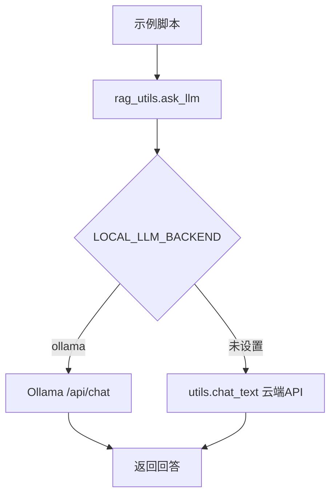
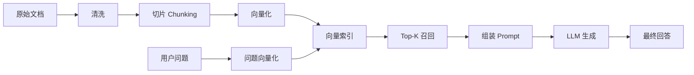
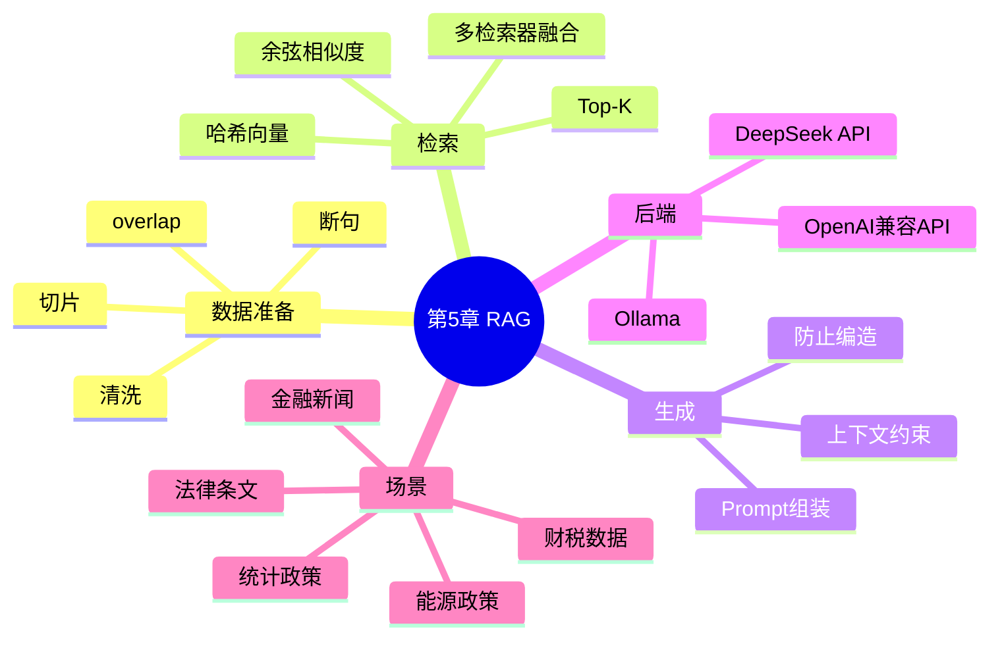
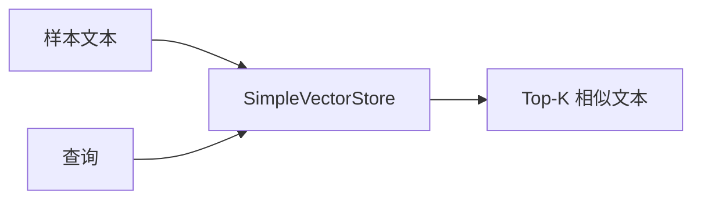
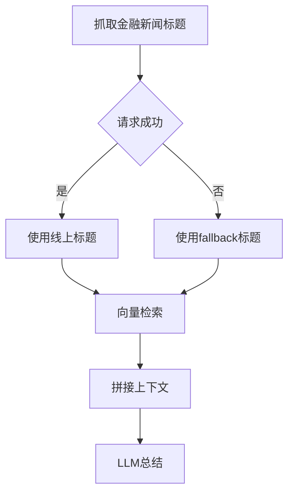
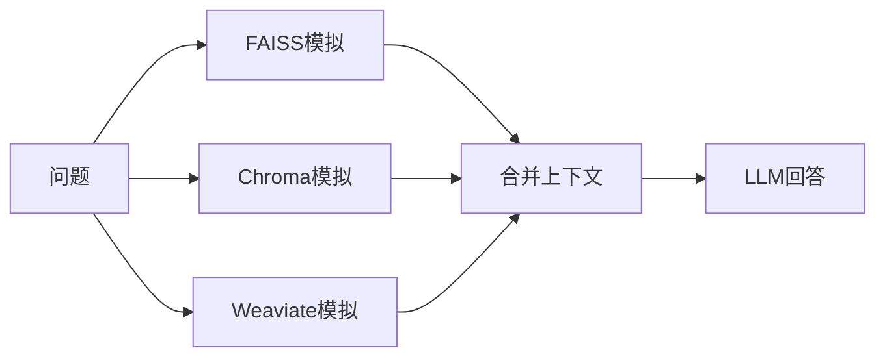
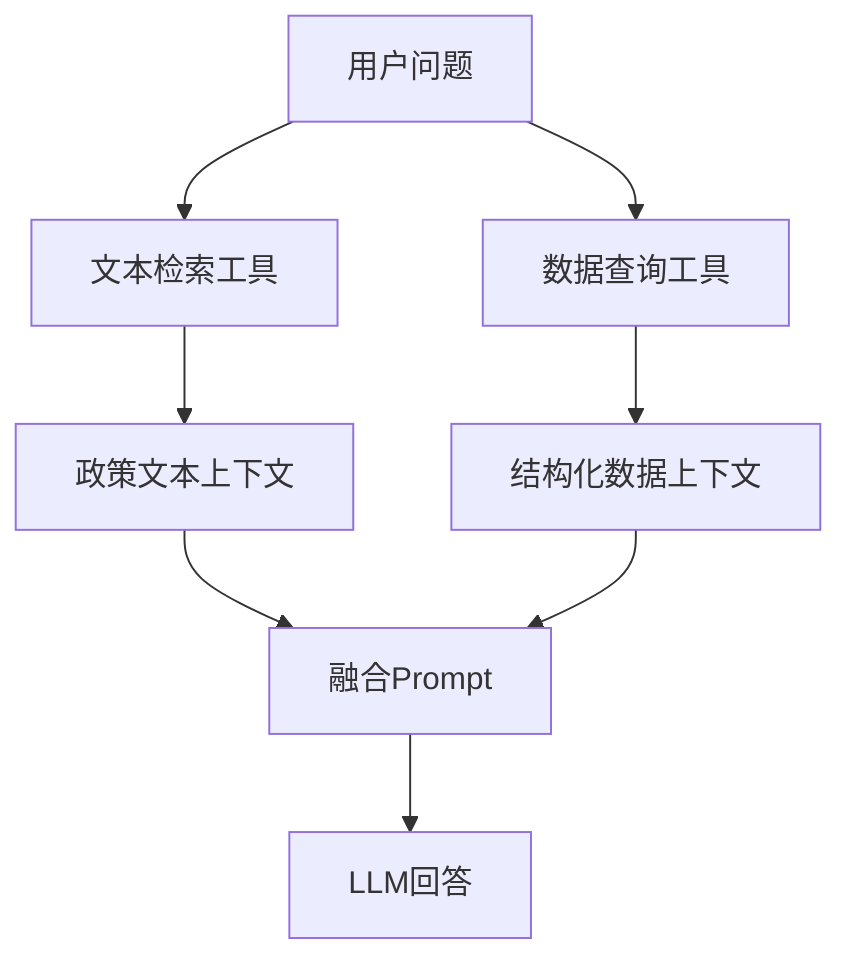

# 第5章：RAG 检索增强生成

本章围绕 RAG（Retrieval-Augmented Generation，检索增强生成）展开：先把文本处理成可检索的知识片段，再召回与问题相关的上下文，最后交给 LLM 生成回答。

当前 `src` 下的示例已经统一改造成轻量本地可运行版本：

- 不强制依赖 FAISS、Chroma、Weaviate、LangChain 或外部 Embedding API。
- 使用 `src/rag_utils.py` 提供哈希向量、余弦相似度、文本切片和统一 LLM 调用。
- 支持本地 Ollama，例如 `gemma4:e2b-mlx`。
- 支持云端 DeepSeek/OpenAI 兼容 API，通过项目根目录 `utils.py` 调用。

本章没有修改任何 `main.py`，所有可运行示例都在 `src` 目录。

## 文件地图

| 文件 | 主题 | 核心知识点 |
| --- | --- | --- |
| `src/rag_utils.py` | RAG 公共工具 | `Document`、哈希向量、余弦相似度、`SimpleVectorStore`、Ollama/云端 LLM 调用 |
| `src/5_1_simple_vector_search.py` | 最小向量检索 | 文本向量化、相似度排序、Top-K 检索 |
| `src/5_2_text_chunking.py` | 文档切片 | 句子切分、chunk、overlap |
| `src/5_3_rag_retrieval_demo.py` | RAG 召回流程 | 知识库、向量索引、Top-K 召回 |
| `src/5_4_chinese_text_cleaning_chunking.py` | 中文清洗切片 | 文本清洗、中文断句、chunk 生成 |
| `src/5_5_finance_news_rag.py` | 金融新闻 RAG | 新闻标题抓取、fallback 数据、检索、LLM 总结 |
| `src/5_6_vector_store_compare_policy_rag.py` | 向量库接口抽象 | 模拟 FAISS/Chroma/Weaviate、多检索器融合 |
| `src/5_7_legal_rag_retrieval_qa.py` | 法律条文 RAG | 条文切片、法律检索、基于上下文回答 |
| `src/5_8_multi_passage_policy_rag.py` | 多段融合 RAG | Top-K 多片段融合、统计政策问答 |
| `src/5_9_hybrid_text_table_rag.py` | 混合 RAG | 文本检索、结构化数据查询、融合生成 |

## 统一后端

`src/rag_utils.py` 是本章的统一工具入口。示例脚本不直接关心“用本地 Ollama 还是云端 API”，只调用：

```python
from rag_utils import SimpleVectorStore, ask_llm, backend_name
```



本地 Ollama 运行：

```bash
cd /Users/dustchen/workdir/dev_agents/projects/agent-getstarted-python
LOCAL_LLM_BACKEND=ollama OLLAMA_MODEL=gemma4:e2b-mlx python3 ch05/src/5_5_finance_news_rag.py
```

云端 DeepSeek/OpenAI 兼容 API 运行：

```bash
cd /Users/dustchen/workdir/dev_agents/projects/agent-getstarted-python
python3 ch05/src/5_5_finance_news_rag.py
```

Ollama 请求中默认设置：

```json
{
  "think": false
}
```

这样可以避免 Gemma/Qwen3 类模型把主要内容放到 thinking 阶段，导致 API 返回的 `content` 为空。

## RAG 运行流程



## 知识结构



## rag_utils.py：公共 RAG 工具

文件：`src/rag_utils.py`

核心组件：

- `Document`：最小文档对象，包含 `page_content` 和可选 `metadata`。
- `tokenize()`：同时处理英文单词、中文单字和中文 bigram。
- `hashing_embedding()`：用哈希技巧生成固定维度向量，适合教学和离线演示。
- `cosine_similarity()`：计算向量相似度。
- `SimpleVectorStore`：内存向量库，支持 `similarity_search(query, k)`。
- `split_text_by_sentences()`：按句子生成 chunk，并支持 overlap。
- `ask_llm()`：统一本地 Ollama 和云端 API。

这不是生产级 Embedding 模型，但非常适合帮助你理解 RAG 的主干流程。

## 例5-1：最小向量检索

文件：`src/5_1_simple_vector_search.py`

这个示例只演示检索，不调用 LLM：



运行：

```bash
python3 ch05/src/5_1_simple_vector_search.py
```

## 例5-2：文档切片

文件：`src/5_2_text_chunking.py`

这个示例展示 RAG 中非常关键的 chunking：

- chunk 太大：召回内容冗余，LLM 上下文浪费。
- chunk 太小：语义不完整，回答容易缺上下文。
- overlap：让相邻 chunk 保留少量上下文连续性。

运行：

```bash
python3 ch05/src/5_2_text_chunking.py
```

## 例5-3：RAG 召回演示

文件：`src/5_3_rag_retrieval_demo.py`

这个例子把 RAG 拆成前半段：

1. 构造知识库。
2. 建立向量索引。
3. 输入问题。
4. 返回最相关的 Top-K 文档。

运行：

```bash
python3 ch05/src/5_3_rag_retrieval_demo.py
```

## 例5-4：中文清洗与切片

文件：`src/5_4_chinese_text_cleaning_chunking.py`

中文 RAG 常见问题：

- 原始文本包含多余空白、符号、网页噪声。
- 中文没有天然空格，不能完全照搬英文分词策略。
- 句号、问号、感叹号对切片边界很重要。

运行：

```bash
python3 ch05/src/5_4_chinese_text_cleaning_chunking.py
```

## 例5-5：金融新闻 RAG

文件：`src/5_5_finance_news_rag.py`

流程：



运行：

```bash
LOCAL_LLM_BACKEND=ollama OLLAMA_MODEL=gemma4:e2b-mlx python3 ch05/src/5_5_finance_news_rag.py
```

云端：

```bash
python3 ch05/src/5_5_finance_news_rag.py
```

## 例5-6：向量库接口抽象

文件：`src/5_6_vector_store_compare_policy_rag.py`

这个示例用 `SimpleVectorStore` 模拟 FAISS、Chroma、Weaviate 的统一检索接口。重点不是数据库性能，而是理解工程上常见的抽象方式：

```python
tool.search(query, k=3)
```



运行：

```bash
LOCAL_LLM_BACKEND=ollama OLLAMA_MODEL=gemma4:e2b-mlx python3 ch05/src/5_6_vector_store_compare_policy_rag.py
```

## 例5-7：法律条文 RAG

文件：`src/5_7_legal_rag_retrieval_qa.py`

法律 RAG 的关键是“回答必须被条文约束”。本例 prompt 明确要求：

- 只能根据提供条文回答。
- 不编造法条编号。
- 不扩展未出现在上下文中的事实。

运行：

```bash
LOCAL_LLM_BACKEND=ollama OLLAMA_MODEL=gemma4:e2b-mlx python3 ch05/src/5_7_legal_rag_retrieval_qa.py
```

## 例5-8：多段融合 RAG

文件：`src/5_8_multi_passage_policy_rag.py`

这个示例演示 Top-K 多段融合。RAG 不是只拿一个最相似片段，而是经常把多个片段合并，让模型在多个证据之间组织答案。

运行：

```bash
LOCAL_LLM_BACKEND=ollama OLLAMA_MODEL=gemma4:e2b-mlx python3 ch05/src/5_8_multi_passage_policy_rag.py
```

## 例5-9：文本 + 表格混合 RAG

文件：`src/5_9_hybrid_text_table_rag.py`

混合 RAG 同时使用两类上下文：

- 非结构化文本：政策说明、新闻、条文。
- 结构化数据：年份、指标、表格行。



运行：

```bash
LOCAL_LLM_BACKEND=ollama OLLAMA_MODEL=gemma4:e2b-mlx python3 ch05/src/5_9_hybrid_text_table_rag.py
```

## 常见坑

- RAG 不等于“把所有文档塞进 prompt”，核心是先检索再生成。
- chunk 大小会显著影响召回质量，过大和过小都会损害效果。
- 本章的哈希向量用于教学，不等价于真实 Embedding 模型。
- 本地 Ollama 慢一些是正常的，`max_tokens` 越大等待越久。
- Gemma/Qwen3 类模型建议在 Ollama 请求里设置 `think:false`，否则可能出现 `content` 为空。
- 金融新闻示例包含网络请求，失败时会自动使用 fallback 示例数据。
- 法律、金融、政策类 RAG 要让模型“只基于上下文回答”，减少幻觉。

## 一键检查

基础示例：

```bash
python3 -m py_compile ch05/src/*.py
python3 ch05/src/5_1_simple_vector_search.py
python3 ch05/src/5_2_text_chunking.py
python3 ch05/src/5_3_rag_retrieval_demo.py
python3 ch05/src/5_4_chinese_text_cleaning_chunking.py
```

本地 Ollama 示例：

```bash
LOCAL_LLM_BACKEND=ollama OLLAMA_MODEL=gemma4:e2b-mlx python3 ch05/src/5_5_finance_news_rag.py
LOCAL_LLM_BACKEND=ollama OLLAMA_MODEL=gemma4:e2b-mlx python3 ch05/src/5_9_hybrid_text_table_rag.py
```
