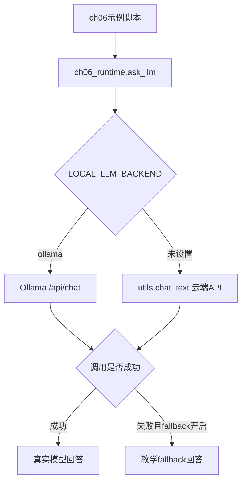
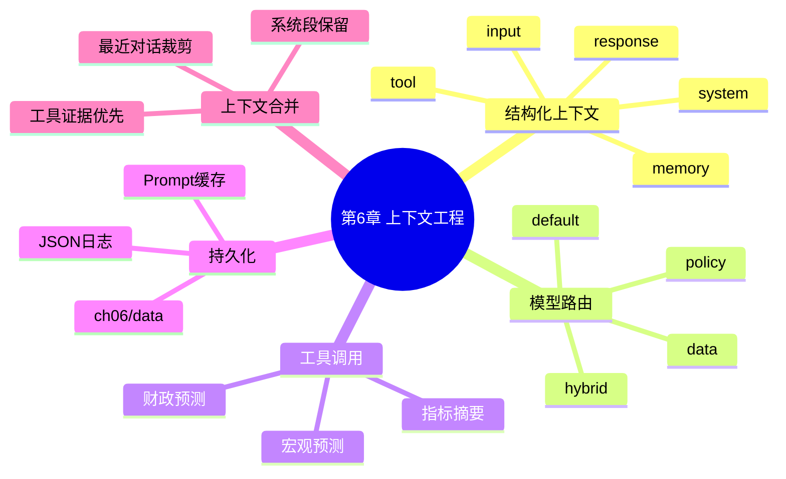
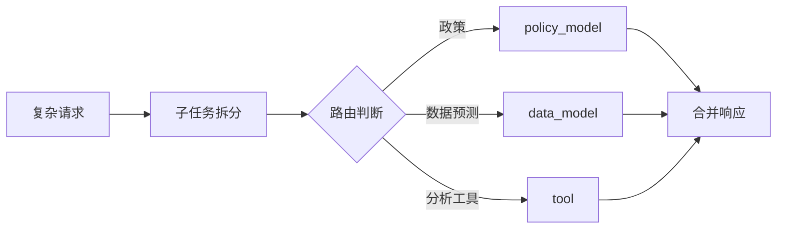
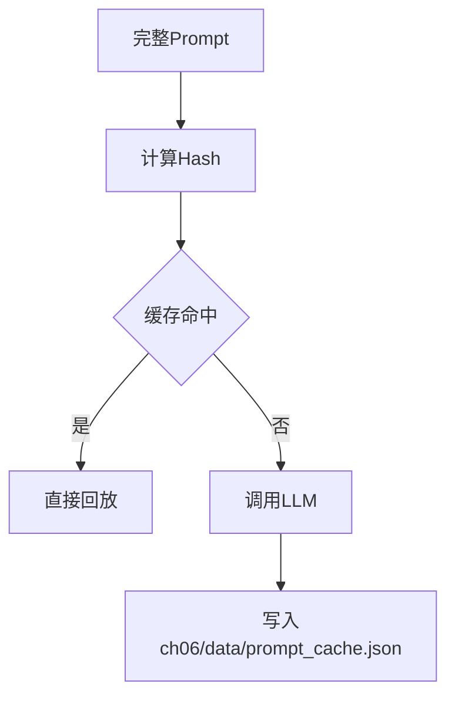

# 第6章：结构化上下文、路由与持久化

本章围绕 Agent 运行时的上下文工程展开：如何把系统提示、用户输入、记忆、工具结果、模型回答拆成结构化段落，并在多模型、多工具、多轮任务中进行路由、合并、缓存和日志追踪。

当前 `src` 下的示例已经移除 `qwen_agent` 依赖，统一使用 `src/ch06_runtime.py`：

- 支持本地 Ollama，例如 `gemma4:e2b-mlx`
- 支持云端 DeepSeek/OpenAI 兼容 API，通过项目根目录 `utils.py` 调用
- 所有持久化数据统一写入 `ch06/data`
- 每个脚本都有 `main()` 入口，可以直接运行测试
- 模型不可用时默认启用教学 fallback，保证示例离线也能跑通

本章没有修改任何 `main.py`，所有可运行示例都在 `src` 目录。

## 文件地图

| 文件 | 主题 | 核心知识点 |
| --- | --- | --- |
| `src/ch06_runtime.py` | 公共运行时 | `Tool`、结构化上下文段、局部 data 路径、Ollama/云端 API 调用、日志与缓存 |
| `src/6_1_structured_context_fusion.py` | 结构化上下文融合 | 用户段、回答段、工具段、双模型视角合并 |
| `src/6_2_system_memory_tool_context.py` | 系统段与工具段 | system、memory、input、tool、final answer 的组合 |
| `src/6_3_multi_task_router.py` | 多任务路由 | 子任务拆分、政策模型、数据模型、工具模块 |
| `src/6_4_model_entry_router.py` | 模型入口决策 | policy/data/hybrid/default 分支 |
| `src/6_5_context_log_persistence.py` | 上下文日志持久化 | JSONL 日志、任务 ID、模型来源、可追溯上下文 |
| `src/6_6_prompt_cache_replay.py` | Prompt 缓存 | prompt hash、缓存命中、快速回放 |
| `src/6_7_dynamic_context_merge.py` | 动态上下文合并 | 系统段保留、工具段优先、最近对话裁剪 |

## 统一后端

所有脚本统一通过 `ch06_runtime.ask_llm()` 调用模型：

```python
from ch06_runtime import ask_llm, backend_name
```



本地 Ollama 运行：

```bash
cd /Users/dustchen/workdir/dev_agents/projects/agent-getstarted-python
LOCAL_LLM_BACKEND=ollama OLLAMA_MODEL=gemma4:e2b-mlx python3 ch06/src/6_1_structured_context_fusion.py
```

云端 DeepSeek/OpenAI 兼容 API 运行：

```bash
cd /Users/dustchen/workdir/dev_agents/projects/agent-getstarted-python
python3 ch06/src/6_1_structured_context_fusion.py
```

如果想让模型调用失败时直接抛错，而不是 fallback：

```bash
CH06_LLM_FALLBACK=0 python3 ch06/src/6_1_structured_context_fusion.py
```

## 局部持久化

本章所有持久化文件统一写入：

```text
/Users/dustchen/workdir/dev_agents/projects/agent-getstarted-python/ch06/data
```

当前会生成：

```text
ch06/data/agent_context_log.jsonl
ch06/data/prompt_cache.json
```

路径由 `ch06_runtime.data_path()` 管理，脚本里不再使用散落的全局相对路径。

## 知识结构



## 例6-1：结构化上下文融合

文件：`src/6_1_structured_context_fusion.py`

这个示例把历史用户输入、模型回答、当前问题组装成结构化上下文，再分别生成政策视角和数据视角回答，最后写回上下文段。

运行：

```bash
LOCAL_LLM_BACKEND=ollama OLLAMA_MODEL=gemma4:e2b-mlx python3 ch06/src/6_1_structured_context_fusion.py
```

## 例6-2：系统段、记忆段与工具段

文件：`src/6_2_system_memory_tool_context.py`

这个示例展示一个典型 Agent Prompt 的构成：

- `system`：角色和回答风格
- `memory`：用户长期偏好
- `input`：当前问题
- `tool`：外部工具结果
- final prompt：把以上上下文合并给 LLM

运行：

```bash
LOCAL_LLM_BACKEND=ollama OLLAMA_MODEL=gemma4:e2b-mlx python3 ch06/src/6_2_system_memory_tool_context.py
```

## 例6-3：多任务路由

文件：`src/6_3_multi_task_router.py`

这个示例把复杂请求拆成多个子任务，再按关键词路由到不同模块：



运行：

```bash
LOCAL_LLM_BACKEND=ollama OLLAMA_MODEL=gemma4:e2b-mlx python3 ch06/src/6_3_multi_task_router.py
```

## 例6-4：模型入口决策

文件：`src/6_4_model_entry_router.py`

根据问题类型选择：

- `policy`：政策解释
- `data`：趋势预测
- `hybrid`：政策视角 + 数据视角融合
- `default`：默认问答

运行：

```bash
LOCAL_LLM_BACKEND=ollama OLLAMA_MODEL=gemma4:e2b-mlx python3 ch06/src/6_4_model_entry_router.py
```

## 例6-5：上下文日志持久化

文件：`src/6_5_context_log_persistence.py`

这个示例会把每一步上下文写入 JSONL：

```text
ch06/data/agent_context_log.jsonl
```

每条日志包含：

- `id`
- `timestamp`
- `task_id`
- `role`
- `type`
- `model`
- `content`
- `meta`

运行：

```bash
LOCAL_LLM_BACKEND=ollama OLLAMA_MODEL=gemma4:e2b-mlx python3 ch06/src/6_5_context_log_persistence.py
```

## 例6-6：Prompt 缓存

文件：`src/6_6_prompt_cache_replay.py`

这个示例用 `md5(prompt)` 作为缓存 key：



运行：

```bash
LOCAL_LLM_BACKEND=ollama OLLAMA_MODEL=gemma4:e2b-mlx python3 ch06/src/6_6_prompt_cache_replay.py
```

## 例6-7：动态上下文合并

文件：`src/6_7_dynamic_context_merge.py`

动态上下文合并策略：

- 永远保留 system 段
- 优先保留最新 tool 段
- 只保留最近若干轮 input/response
- 避免把无关历史无限塞进 prompt

运行：

```bash
LOCAL_LLM_BACKEND=ollama OLLAMA_MODEL=gemma4:e2b-mlx python3 ch06/src/6_7_dynamic_context_merge.py
```

## 一键检查

```bash
python3 -m py_compile ch06/src/*.py
python3 ch06/src/6_1_structured_context_fusion.py
python3 ch06/src/6_2_system_memory_tool_context.py
python3 ch06/src/6_3_multi_task_router.py
python3 ch06/src/6_4_model_entry_router.py
python3 ch06/src/6_5_context_log_persistence.py
python3 ch06/src/6_6_prompt_cache_replay.py
python3 ch06/src/6_7_dynamic_context_merge.py
```
