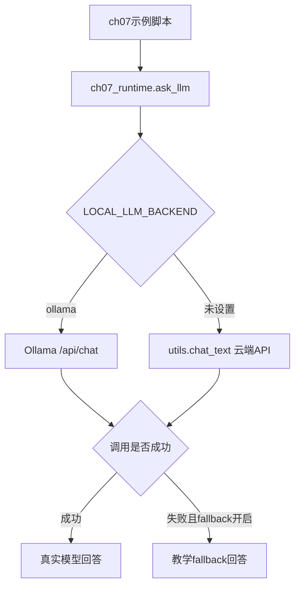
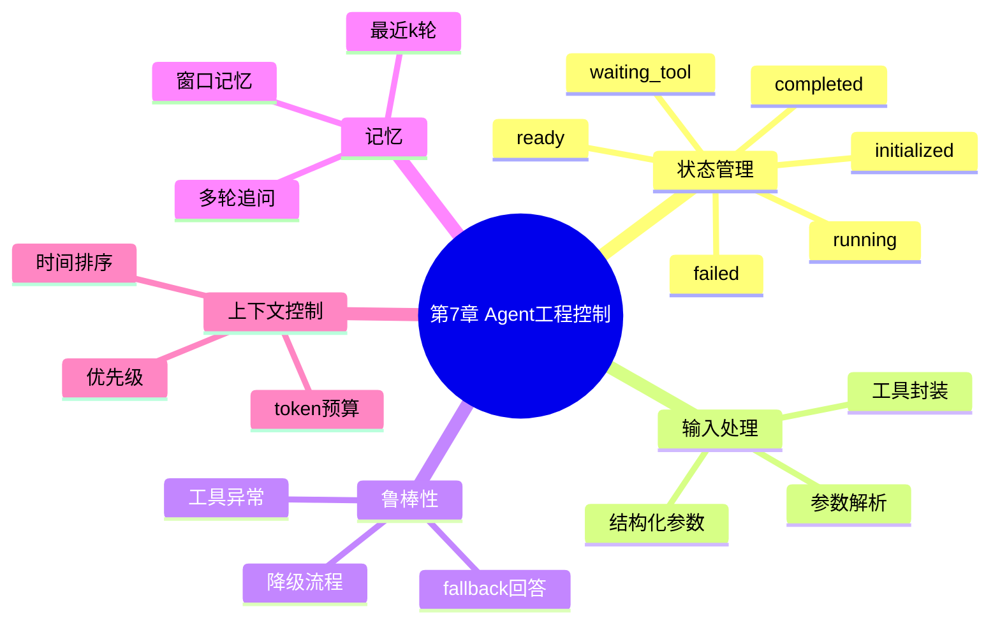
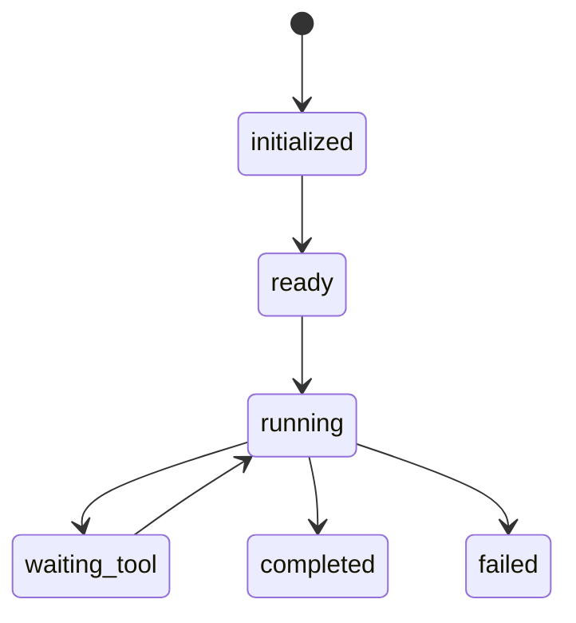
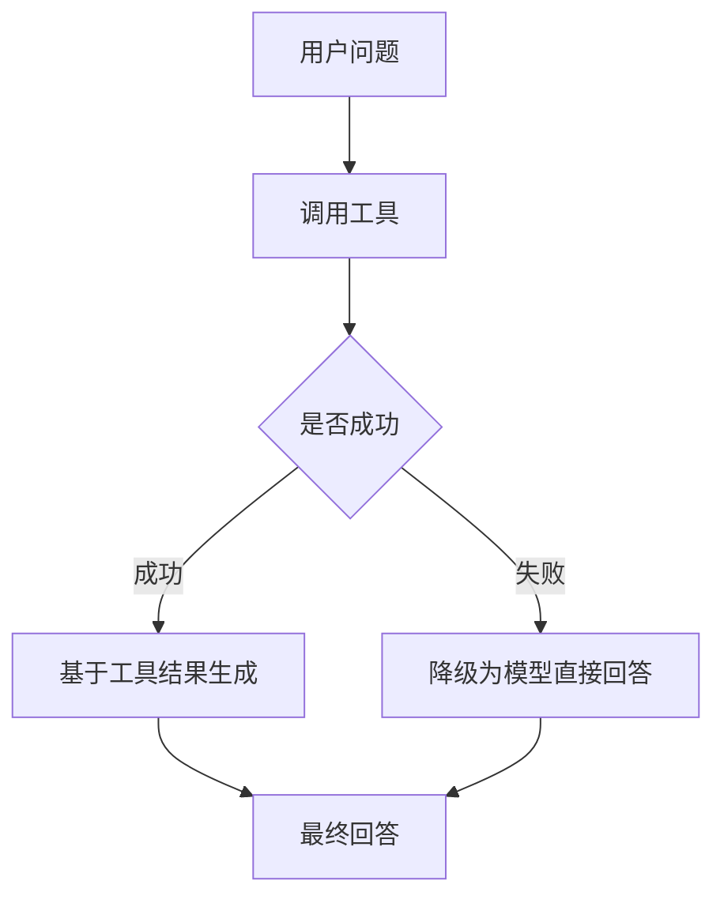
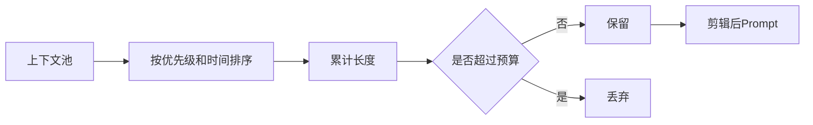

# 第7章：Agent 状态管理、鲁棒性与上下文控制

本章围绕更工程化的 Agent 运行机制展开：任务状态流转、输入参数解析、工具异常降级、窗口记忆和动态上下文剪辑。

当前 `src` 下的示例已经移除 `qwen_agent` 依赖，统一使用 `src/ch07_runtime.py`：

- 支持本地 Ollama，例如 `gemma4:e2b-mlx`
- 支持云端 DeepSeek/OpenAI 兼容 API，通过项目根目录 `utils.py` 调用
- 预留局部持久化目录 `ch07/data`
- 每个脚本都有 `main()` 入口，可以直接运行测试
- 模型不可用时默认启用教学 fallback，保证示例离线也能跑通

本章没有修改任何 `main.py`，所有可运行示例都在 `src` 目录。

## 文件地图

| 文件 | 主题 | 核心知识点 |
| --- | --- | --- |
| `src/ch07_runtime.py` | 公共运行时 | `Tool`、`ask_llm`、Ollama/云端 API、窗口记忆、上下文段 |
| `src/7_1_stateful_agent_lifecycle.py` | 状态管理 Agent | initialized、ready、running、waiting_tool、completed、failed |
| `src/7_2_input_parameter_parser.py` | 输入参数解析 | 从自然语言提取 region、year、focus，再调用工具 |
| `src/7_3_robust_agent_error_fallback.py` | 异常处理与降级 | 工具失败、异常捕获、切换为模型直接回答 |
| `src/7_4_window_memory_agent.py` | 窗口记忆 Agent | 最近 k 轮对话、工具结果、多轮追问 |
| `src/7_5_dynamic_context_clipping.py` | 动态上下文剪辑 | 优先级、时间排序、token 预算控制 |

## 统一后端

所有脚本统一通过 `ch07_runtime.ask_llm()` 调用模型：

```python
from ch07_runtime import ask_llm, backend_name
```



本地 Ollama 运行：

```bash
cd /Users/dustchen/workdir/dev_agents/projects/agent-getstarted-python
LOCAL_LLM_BACKEND=ollama OLLAMA_MODEL=gemma4:e2b-mlx python3 ch07/src/7_1_stateful_agent_lifecycle.py
```

云端 DeepSeek/OpenAI 兼容 API 运行：

```bash
cd /Users/dustchen/workdir/dev_agents/projects/agent-getstarted-python
python3 ch07/src/7_1_stateful_agent_lifecycle.py
```

如果想让模型调用失败时直接抛错，而不是 fallback：

```bash
CH07_LLM_FALLBACK=0 python3 ch07/src/7_1_stateful_agent_lifecycle.py
```

## 局部数据目录

本章预留局部数据目录：

```text
/Users/dustchen/workdir/dev_agents/projects/agent-getstarted-python/ch07/data
```

当前示例主要演示运行状态和内存上下文，没有必须落盘的数据。后续如果加入日志、缓存或会话快照，应统一使用 `ch07_runtime.data_path()`，不要写到项目根目录。

## 知识结构



## 例7-1：状态管理 Agent

文件：`src/7_1_stateful_agent_lifecycle.py`

这个示例展示 Agent 任务执行时的状态流转：



运行：

```bash
LOCAL_LLM_BACKEND=ollama OLLAMA_MODEL=gemma4:e2b-mlx python3 ch07/src/7_1_stateful_agent_lifecycle.py
```

## 例7-2：输入参数解析

文件：`src/7_2_input_parameter_parser.py`

这个示例把自然语言问题解析为结构化参数：

```json
{
  "region": "美国",
  "year": 2024,
  "focus": "GDP"
}
```

再把参数传给经济预测工具，最后由模型生成解释。

运行：

```bash
LOCAL_LLM_BACKEND=ollama OLLAMA_MODEL=gemma4:e2b-mlx python3 ch07/src/7_2_input_parameter_parser.py
```

## 例7-3：异常处理与降级

文件：`src/7_3_robust_agent_error_fallback.py`

这个示例模拟一个可能失败的远程工具：

- 工具正常：基于工具结果生成回答。
- 工具失败：捕获异常，切换为模型直接回答。



运行：

```bash
LOCAL_LLM_BACKEND=ollama OLLAMA_MODEL=gemma4:e2b-mlx python3 ch07/src/7_3_robust_agent_error_fallback.py
```

## 例7-4：窗口记忆 Agent

文件：`src/7_4_window_memory_agent.py`

这个示例使用 `ConversationWindowMemory(k=3)` 保存最近 3 轮对话，避免无限扩张上下文。

知识点：

- 记忆不是模型自动拥有的，需要显式保存并放回 prompt。
- 窗口记忆适合多轮追问，例如“那 2023 年呢？”、“依据是什么？”。
- 只保留最近 k 轮可以控制上下文长度。

运行：

```bash
LOCAL_LLM_BACKEND=ollama OLLAMA_MODEL=gemma4:e2b-mlx python3 ch07/src/7_4_window_memory_agent.py
```

## 例7-5：动态上下文剪辑

文件：`src/7_5_dynamic_context_clipping.py`

这个示例根据优先级、时间和 token 预算剪辑上下文：

- system 段优先级最高。
- tool 段作为外部证据优先保留。
- 越新的 input/response 越优先。
- 超过 token 预算的内容会被丢弃。



运行：

```bash
LOCAL_LLM_BACKEND=ollama OLLAMA_MODEL=gemma4:e2b-mlx python3 ch07/src/7_5_dynamic_context_clipping.py
```

## 一键检查

```bash
python3 -m py_compile ch07/src/*.py
python3 ch07/src/7_1_stateful_agent_lifecycle.py
python3 ch07/src/7_2_input_parameter_parser.py
python3 ch07/src/7_3_robust_agent_error_fallback.py
python3 ch07/src/7_4_window_memory_agent.py
python3 ch07/src/7_5_dynamic_context_clipping.py
```
