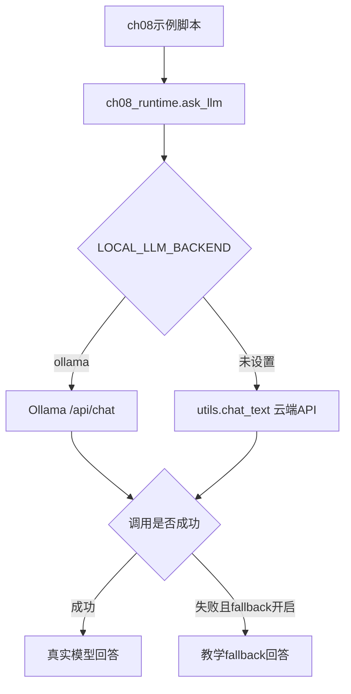
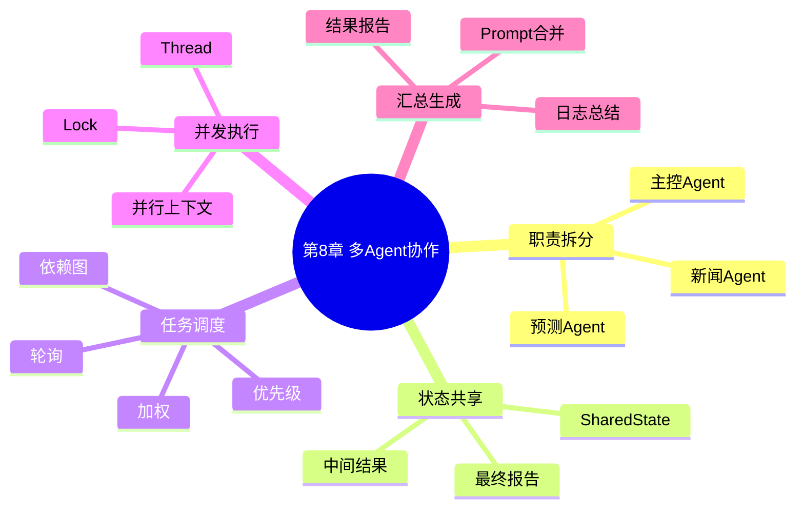
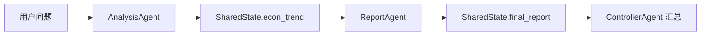
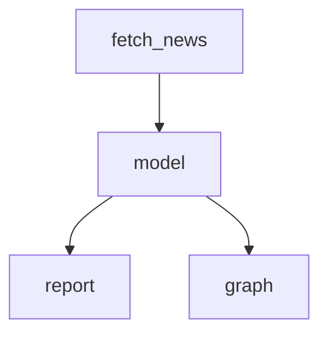
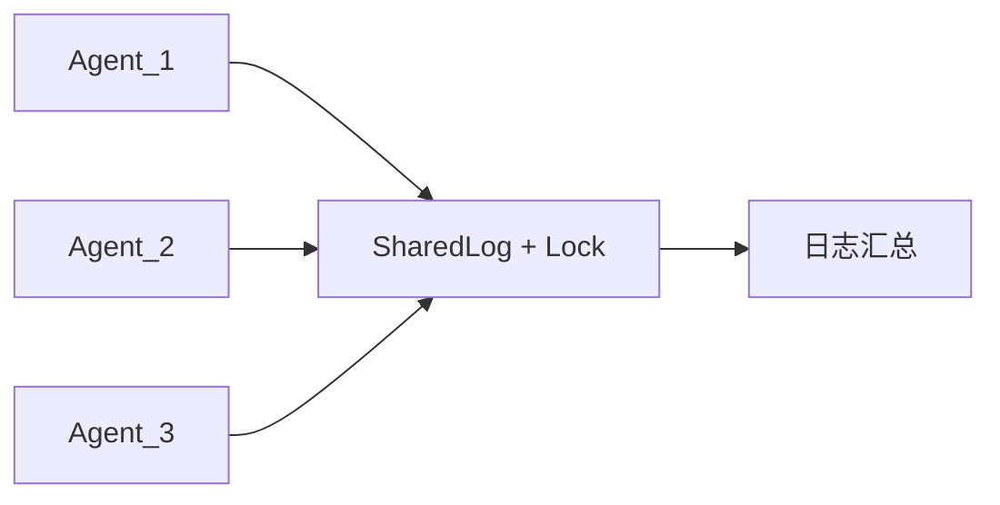

# 第8章：多 Agent 协作、调度与并发控制

本章围绕多 Agent 系统展开：如何按职责拆分子 Agent、共享状态、调度任务、处理依赖、并行执行、隔离上下文，以及使用锁保护共享日志。

当前 `src` 下的示例已经移除 `qwen_agent` 依赖，统一使用 `src/ch08_runtime.py`：

- 支持本地 Ollama，例如 `gemma4:e2b-mlx`
- 支持云端 DeepSeek/OpenAI 兼容 API，通过项目根目录 `utils.py` 调用
- 预留局部持久化目录 `ch08/data`
- 每个脚本都有 `main()` 入口，可以直接运行测试
- 模型不可用时默认启用教学 fallback，保证示例离线也能跑通

本章没有修改任何 `main.py`，所有可运行示例都在 `src` 目录。

## 文件地图

| 文件 | 主题 | 核心知识点 |
| --- | --- | --- |
| `src/ch08_runtime.py` | 公共运行时 | `Tool`、`Message`、`ask_llm`、Ollama/云端 API、局部 data 路径 |
| `src/8_1_role_based_multi_agent.py` | 职责建模 | 新闻 Agent、预测 Agent、主控 Agent |
| `src/8_2_shared_state_coordination.py` | 共享状态 | `SharedState`、状态更新、跨 Agent 数据传递 |
| `src/8_3_task_dispatcher_strategy.py` | 任务调度策略 | 轮询调度、加权调度、Agent 选择 |
| `src/8_4_dependency_priority_scheduler.py` | 依赖与优先级 | 任务图、依赖解锁、优先队列 |
| `src/8_5_parallel_subagent_executor.py` | 并行执行 | 多线程子 Agent、结果汇总、锁保护结果写入 |
| `src/8_6_parallel_context_isolation.py` | 上下文隔离 | 每个任务独立上下文、并行执行、最终汇总 |
| `src/8_7_thread_safe_shared_log.py` | 线程安全共享日志 | `threading.Lock`、并发写入、共享日志总结 |

## 统一后端

所有脚本统一通过 `ch08_runtime.ask_llm()` 调用模型：

```python
from ch08_runtime import ask_llm, backend_name
```



本地 Ollama 运行：

```bash
cd /Users/dustchen/workdir/dev_agents/projects/agent-getstarted-python
LOCAL_LLM_BACKEND=ollama OLLAMA_MODEL=gemma4:e2b-mlx python3 ch08/src/8_1_role_based_multi_agent.py
```

云端 DeepSeek/OpenAI 兼容 API 运行：

```bash
cd /Users/dustchen/workdir/dev_agents/projects/agent-getstarted-python
python3 ch08/src/8_1_role_based_multi_agent.py
```

如果想让模型调用失败时直接抛错，而不是 fallback：

```bash
CH08_LLM_FALLBACK=0 python3 ch08/src/8_1_role_based_multi_agent.py
```

## 局部数据目录

本章预留局部数据目录：

```text
/Users/dustchen/workdir/dev_agents/projects/agent-getstarted-python/ch08/data
```

当前示例主要演示内存中的协作状态、任务队列和并发日志，没有必须落盘的数据。后续如果加入任务日志、队列快照或中间结果缓存，应统一使用：

```python
from ch08_runtime import data_path
```

## 知识结构



## 例8-1：职责建模多 Agent

文件：`src/8_1_role_based_multi_agent.py`

这个示例把任务拆成三个角色：

- `NewsAgent`：提取财经资讯摘要。
- `ForecastAgent`：根据摘要做经济预测。
- `ControlAgent`：按流程调度子 Agent 并汇总最终回答。

运行：

```bash
LOCAL_LLM_BACKEND=ollama OLLAMA_MODEL=gemma4:e2b-mlx python3 ch08/src/8_1_role_based_multi_agent.py
```

## 例8-2：共享状态协作

文件：`src/8_2_shared_state_coordination.py`

这个示例用 `SharedState` 让多个 Agent 共享中间结果：



运行：

```bash
LOCAL_LLM_BACKEND=ollama OLLAMA_MODEL=gemma4:e2b-mlx python3 ch08/src/8_2_shared_state_coordination.py
```

## 例8-3：任务调度策略

文件：`src/8_3_task_dispatcher_strategy.py`

这个示例演示两种调度策略：

- `round_robin`：轮询分配任务。
- `weighted`：按权重提高高质量 Agent 被选中的概率。

运行：

```bash
LOCAL_LLM_BACKEND=ollama OLLAMA_MODEL=gemma4:e2b-mlx python3 ch08/src/8_3_task_dispatcher_strategy.py
```

## 例8-4：依赖与优先级调度

文件：`src/8_4_dependency_priority_scheduler.py`

这个示例把任务建成一个小型 DAG：



执行器会先满足依赖，再按优先级执行可运行任务。

运行：

```bash
LOCAL_LLM_BACKEND=ollama OLLAMA_MODEL=gemma4:e2b-mlx python3 ch08/src/8_4_dependency_priority_scheduler.py
```

## 例8-5：并行子 Agent

文件：`src/8_5_parallel_subagent_executor.py`

这个示例用多线程并行执行：

- 政策分析
- 市场情绪
- 趋势预测

每个子 Agent 结果写入共享结果字典，写入时用锁保护。

运行：

```bash
LOCAL_LLM_BACKEND=ollama OLLAMA_MODEL=gemma4:e2b-mlx python3 ch08/src/8_5_parallel_subagent_executor.py
```

## 例8-6：并行上下文隔离

文件：`src/8_6_parallel_context_isolation.py`

这个示例为每个并行任务创建独立上下文：

```text
task_001 -> [user, assistant]
task_002 -> [user, assistant]
task_003 -> [user, assistant]
```

避免多个任务的历史消息相互污染。

运行：

```bash
LOCAL_LLM_BACKEND=ollama OLLAMA_MODEL=gemma4:e2b-mlx python3 ch08/src/8_6_parallel_context_isolation.py
```

## 例8-7：线程安全共享日志

文件：`src/8_7_thread_safe_shared_log.py`

这个示例展示多个子 Agent 并发写共享日志时为什么要使用 `threading.Lock`：



运行：

```bash
LOCAL_LLM_BACKEND=ollama OLLAMA_MODEL=gemma4:e2b-mlx python3 ch08/src/8_7_thread_safe_shared_log.py
```

## 一键检查

```bash
python3 -m py_compile ch08/src/*.py
python3 ch08/src/8_1_role_based_multi_agent.py
python3 ch08/src/8_2_shared_state_coordination.py
python3 ch08/src/8_3_task_dispatcher_strategy.py
python3 ch08/src/8_4_dependency_priority_scheduler.py
python3 ch08/src/8_5_parallel_subagent_executor.py
python3 ch08/src/8_6_parallel_context_isolation.py
python3 ch08/src/8_7_thread_safe_shared_log.py
```
