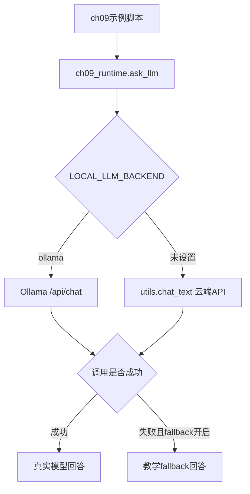
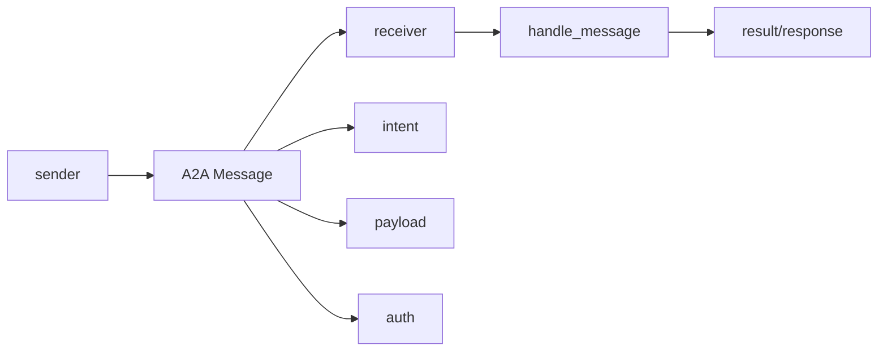
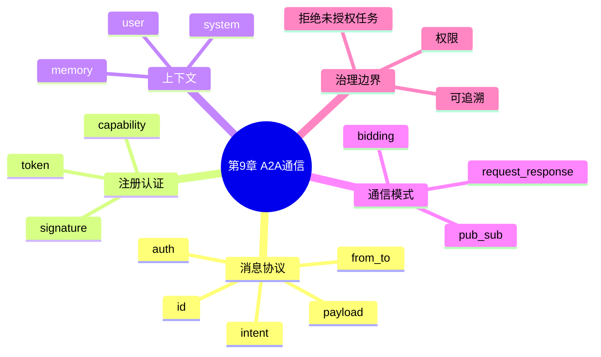
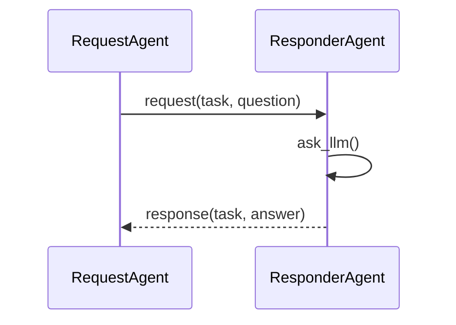
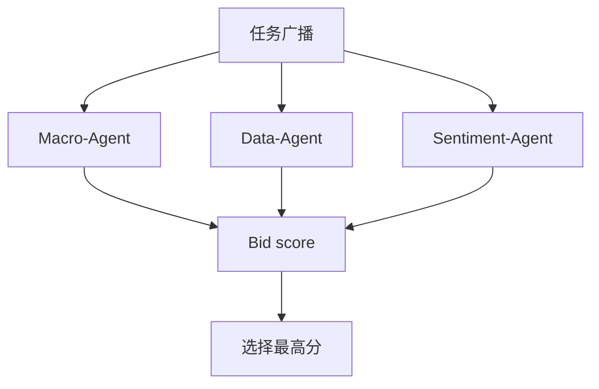

# 第9章：A2A Agent 通信协议与协作模式

本章围绕 A2A（Agent-to-Agent）通信展开：消息格式、注册认证、上下文传递、请求响应、发布订阅和竞标式任务分配。

当前 `src` 下的示例已经移除 `qwen_agent` 依赖，统一使用 `src/ch09_runtime.py`：

- 支持本地 Ollama，例如 `gemma4:e2b-mlx`
- 支持云端 DeepSeek/OpenAI 兼容 API，通过项目根目录 `utils.py` 调用
- 预留局部持久化目录 `ch09/data`
- 每个脚本都有 `main()` 入口，可以直接运行测试
- 模型不可用时默认启用教学 fallback，保证示例离线也能跑通

本章没有修改任何 `main.py`，所有可运行示例都在 `src` 目录。

## 文件地图

| 文件 | 主题 | 核心知识点 |
| --- | --- | --- |
| `src/ch09_runtime.py` | 公共运行时 | `PromptEntry`、`ask_llm`、Ollama/云端 API、局部 data 路径 |
| `src/9_1_a2a_message_dispatch.py` | A2A 消息调度 | sender、receiver、intent、context_id、payload、auth |
| `src/9_2_agent_registry_auth.py` | 注册与认证 | AgentRegistry、token、signature、capability 校验 |
| `src/9_3_context_aware_a2a_agent.py` | 上下文感知 Agent | system/user/memory prompt、按接收方分发任务 |
| `src/9_4_request_response_protocol.py` | 请求-响应协议 | request message、response message、任务应答 |
| `src/9_5_pubsub_broadcast_agents.py` | 发布订阅 | topic filter、广播消息、多订阅者响应 |
| `src/9_6_competitive_bidding_agents.py` | 竞标式分配 | 广播任务、proposal、score、选择最高分 Agent |

## 统一后端

模型相关脚本统一通过 `ch09_runtime.ask_llm()` 调用：

```python
from ch09_runtime import PromptEntry, ask_llm, backend_name
```



本地 Ollama 运行：

```bash
cd /Users/dustchen/workdir/dev_agents/projects/agent-getstarted-python
LOCAL_LLM_BACKEND=ollama OLLAMA_MODEL=gemma4:e2b-mlx python3 ch09/src/9_3_context_aware_a2a_agent.py
```

云端 DeepSeek/OpenAI 兼容 API 运行：

```bash
cd /Users/dustchen/workdir/dev_agents/projects/agent-getstarted-python
python3 ch09/src/9_3_context_aware_a2a_agent.py
```

如果想让模型调用失败时直接抛错，而不是 fallback：

```bash
CH09_LLM_FALLBACK=0 python3 ch09/src/9_3_context_aware_a2a_agent.py
```

## 局部数据目录

本章预留局部数据目录：

```text
/Users/dustchen/workdir/dev_agents/projects/agent-getstarted-python/ch09/data
```

当前示例主要演示内存中的通信消息、注册表和调度流程，没有必须落盘的数据。后续如果加入消息日志、通信审计或会话快照，应统一使用：

```python
from ch09_runtime import data_path
```

## A2A 消息结构

典型 A2A 消息包含：

```json
{
  "id": "msg-...",
  "timestamp": "2026-06-07T08:00:00Z",
  "from": "agent:planner",
  "to": "agent:executor",
  "type": "command",
  "intent": "run_task",
  "context_id": "ctx-...",
  "payload": {
    "task": "analyze_financial_trends",
    "params": {}
  },
  "auth": {
    "token": "...",
    "signature": "..."
  }
}
```



## 知识结构



## 例9-1：A2A 消息调度

文件：`src/9_1_a2a_message_dispatch.py`

这个示例不调用 LLM，重点展示 A2A 消息如何构造、注册 Agent、按 `to` 字段分发到目标 Agent。

运行：

```bash
python3 ch09/src/9_1_a2a_message_dispatch.py
```

## 例9-2：注册中心与认证

文件：`src/9_2_agent_registry_auth.py`

这个示例实现：

- Agent 注册
- token / signature 校验
- capability 权限检查
- 不具备能力时拒绝执行

运行：

```bash
python3 ch09/src/9_2_agent_registry_auth.py
```

## 例9-3：上下文感知 Agent

文件：`src/9_3_context_aware_a2a_agent.py`

这个示例把 A2A 消息中的 `task` 和 `content` 转成结构化 prompt：

- `system`：说明当前 Agent 身份
- `user`：当前任务
- `memory`：历史背景资料

运行：

```bash
LOCAL_LLM_BACKEND=ollama OLLAMA_MODEL=gemma4:e2b-mlx python3 ch09/src/9_3_context_aware_a2a_agent.py
```

## 例9-4：请求-响应协议

文件：`src/9_4_request_response_protocol.py`

这个示例展示两个 Agent 的同步交互：



运行：

```bash
LOCAL_LLM_BACKEND=ollama OLLAMA_MODEL=gemma4:e2b-mlx python3 ch09/src/9_4_request_response_protocol.py
```

## 例9-5：发布订阅广播

文件：`src/9_5_pubsub_broadcast_agents.py`

这个示例用 topic filter 控制哪些订阅者会处理消息：

- `Finance-Agent` 订阅财经主题
- `AI-Finance-Agent` 订阅 AI 或财经主题

运行：

```bash
LOCAL_LLM_BACKEND=ollama OLLAMA_MODEL=gemma4:e2b-mlx python3 ch09/src/9_5_pubsub_broadcast_agents.py
```

## 例9-6：竞标式任务分配

文件：`src/9_6_competitive_bidding_agents.py`

这个示例模拟主控 Agent 广播任务，多个候选 Agent 生成 proposal 并给出评分，最终选择最高分 Agent。



运行：

```bash
LOCAL_LLM_BACKEND=ollama OLLAMA_MODEL=gemma4:e2b-mlx python3 ch09/src/9_6_competitive_bidding_agents.py
```

## 一键检查

```bash
python3 -m py_compile ch09/src/*.py
python3 ch09/src/9_1_a2a_message_dispatch.py
python3 ch09/src/9_2_agent_registry_auth.py
python3 ch09/src/9_3_context_aware_a2a_agent.py
python3 ch09/src/9_4_request_response_protocol.py
python3 ch09/src/9_5_pubsub_broadcast_agents.py
python3 ch09/src/9_6_competitive_bidding_agents.py
```
