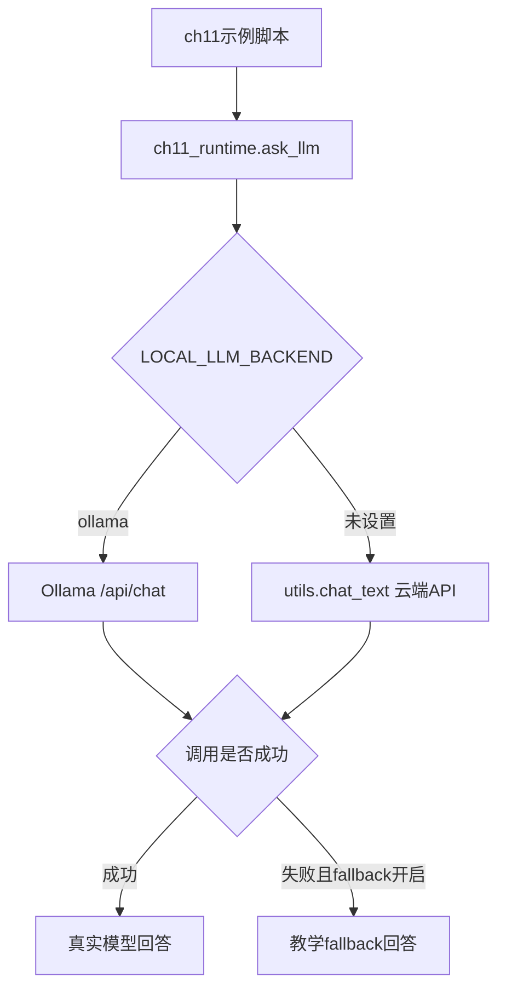
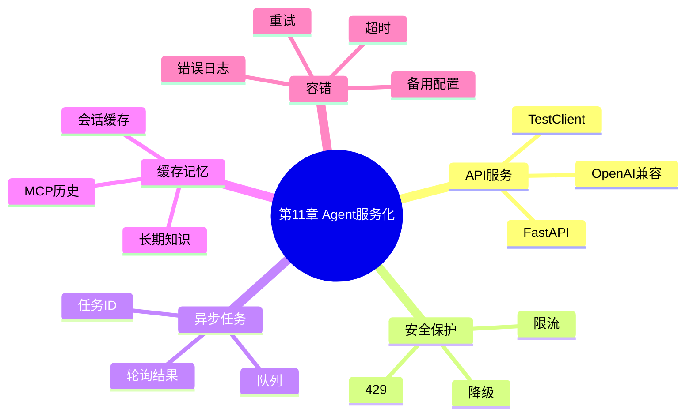
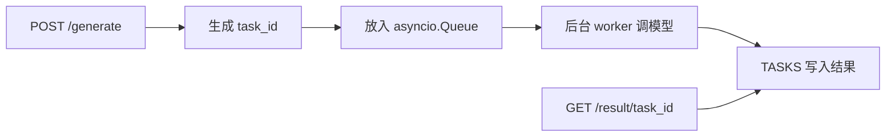

# 第11章：Agent 服务化、异步队列、缓存与容错

本章围绕“把 Agent 能力工程化为稳定服务”展开：OpenAI-compatible API、限流、安全边界、异步任务队列、多层缓存、容错降级和优先级队列。

当前 `src` 下的示例已经移除本地 CUDA/Transformers 强依赖，统一使用 `src/ch11_runtime.py`：

- 支持本地 Ollama，例如 `gemma4:e2b-mlx`
- 支持云端 DeepSeek/OpenAI 兼容 API，通过项目根目录 `utils.py` 调用
- 所有持久化数据统一写入 `ch11/data`
- 每个脚本都有 `main()` 入口，可以直接运行测试
- 模型不可用时默认启用教学 fallback，保证示例离线也能跑通

本章没有修改任何 `main.py`，所有可运行示例都在 `src` 目录。

## 文件地图

| 文件 | 主题 | 核心知识点 |
| --- | --- | --- |
| `src/ch11_runtime.py` | 公共运行时 | `ask_llm`、Ollama/云端 API、OpenAI-compatible 响应、局部 data 路径 |
| `src/11_1_openai_compatible_fastapi.py` | Chat API 服务 | `/v1/chat/completions`、OpenAI-compatible 响应结构 |
| `src/11_2_secure_rate_limited_api.py` | 限流 API | 每 IP 每分钟限制、429 响应、服务保护 |
| `src/11_3_async_task_queue_api.py` | 异步任务队列 | 提交任务、轮询结果、后台 worker |
| `src/11_4_memory_cache_rag_agent.py` | 多层缓存与记忆 | 长期知识、会话缓存、MCP 消息缓存 |
| `src/11_5_resilient_agent_fallback.py` | 容错降级 | 超时、重试、备用配置、错误日志 |
| `src/11_6_rate_limit_queue_service.py` | 限流 + 优先级队列 | Token bucket、PriorityQueue、降级响应 |

## 统一后端

所有模型调用统一通过 `ch11_runtime.ask_llm()`：

```python
from ch11_runtime import ask_llm, backend_name
```



本地 Ollama 运行：

```bash
cd /Users/dustchen/workdir/dev_agents/projects/agent-getstarted-python
LOCAL_LLM_BACKEND=ollama OLLAMA_MODEL=gemma4:e2b-mlx python3 ch11/src/11_1_openai_compatible_fastapi.py
```

云端 DeepSeek/OpenAI 兼容 API 运行：

```bash
cd /Users/dustchen/workdir/dev_agents/projects/agent-getstarted-python
python3 ch11/src/11_1_openai_compatible_fastapi.py
```

如果想让模型调用失败时直接抛错，而不是 fallback：

```bash
CH11_LLM_FALLBACK=0 python3 ch11/src/11_4_memory_cache_rag_agent.py
```

## 局部数据目录

本章所有持久化文件统一写入：

```text
/Users/dustchen/workdir/dev_agents/projects/agent-getstarted-python/ch11/data
```

当前会生成：

```text
ch11/data/sample_knowledge.txt
ch11/data/logs/agent_error.log
```

## 知识结构



## 例11-1：OpenAI-compatible API

文件：`src/11_1_openai_compatible_fastapi.py`

提供接口：

```text
POST /v1/chat/completions
```

运行：

```bash
LOCAL_LLM_BACKEND=ollama OLLAMA_MODEL=gemma4:e2b-mlx python3 ch11/src/11_1_openai_compatible_fastapi.py
```

测试：

```bash
curl -X POST http://127.0.0.1:8011/v1/chat/completions \
  -H "Content-Type: application/json" \
  -d '{"messages":[{"role":"user","content":"你好，介绍一下你自己。"}],"max_tokens":120}'
```

## 例11-2：带限流的 API

文件：`src/11_2_secure_rate_limited_api.py`

这个示例用内存窗口实现每客户端每分钟请求限制。超过限制时返回：

```text
HTTP 429 请求过多，请稍后重试。
```

运行：

```bash
LOCAL_LLM_BACKEND=ollama OLLAMA_MODEL=gemma4:e2b-mlx python3 ch11/src/11_2_secure_rate_limited_api.py
```

## 例11-3：异步任务队列

文件：`src/11_3_async_task_queue_api.py`

流程：



运行：

```bash
LOCAL_LLM_BACKEND=ollama OLLAMA_MODEL=gemma4:e2b-mlx python3 ch11/src/11_3_async_task_queue_api.py
```

## 例11-4：多层缓存与记忆 RAG

文件：`src/11_4_memory_cache_rag_agent.py`

这个示例包含：

- 长期知识文件：`ch11/data/sample_knowledge.txt`
- 会话缓存：`SESSION_CACHE`
- MCP 消息缓存：`MCP_CACHE`
- 简单字符重叠检索

运行：

```bash
LOCAL_LLM_BACKEND=ollama OLLAMA_MODEL=gemma4:e2b-mlx python3 ch11/src/11_4_memory_cache_rag_agent.py
```

## 例11-5：容错与备用后端

文件：`src/11_5_resilient_agent_fallback.py`

容错机制：

- 每个模型配置最多重试 `max_retries` 次
- 单次调用有 `timeout`
- 失败写入 `ch11/data/logs/agent_error.log`
- 全部失败时返回兜底响应

运行：

```bash
LOCAL_LLM_BACKEND=ollama OLLAMA_MODEL=gemma4:e2b-mlx python3 ch11/src/11_5_resilient_agent_fallback.py
```

## 例11-6：限流与优先级队列服务

文件：`src/11_6_rate_limit_queue_service.py`

这个示例组合了：

- Token bucket 限流
- `asyncio.PriorityQueue`
- 后台 worker
- 模型调用失败降级

运行：

```bash
LOCAL_LLM_BACKEND=ollama OLLAMA_MODEL=gemma4:e2b-mlx python3 ch11/src/11_6_rate_limit_queue_service.py
```

## Colab 说明

原始脚本使用 `transformers + Qwen/Qwen3-7B + CUDA`，更适合在 Colab T4/A100 这类 GPU 环境中运行。本地 Mac 推荐优先使用 Ollama。

在 Colab 中如果你想直接测试 Transformers 版本，可以参考：

```python
!pip install -U transformers accelerate torch

from transformers import AutoTokenizer, AutoModelForCausalLM
import torch

model_id = "Qwen/Qwen3-1.7B"
tokenizer = AutoTokenizer.from_pretrained(model_id)
model = AutoModelForCausalLM.from_pretrained(
    model_id,
    device_map="auto",
    dtype=torch.float16,
)

messages = [{"role": "user", "content": "你好，介绍一下你自己。"}]
inputs = tokenizer.apply_chat_template(
    messages,
    tokenize=True,
    add_generation_prompt=True,
    return_tensors="pt",
).to(model.device)

outputs = model.generate(inputs, max_new_tokens=160)
print(tokenizer.decode(outputs[0][inputs.shape[-1]:], skip_special_tokens=True))
```

## 一键检查

```bash
python3 -m py_compile ch11/src/*.py
python3 ch11/src/11_4_memory_cache_rag_agent.py
python3 ch11/src/11_5_resilient_agent_fallback.py
```

服务型脚本建议用 FastAPI TestClient 或启动后用 `curl` 测试。
