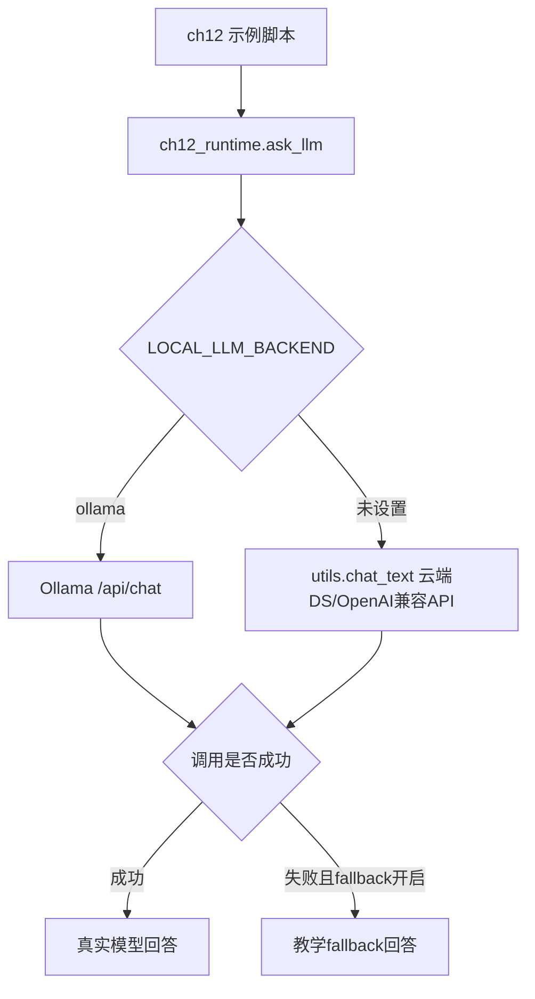
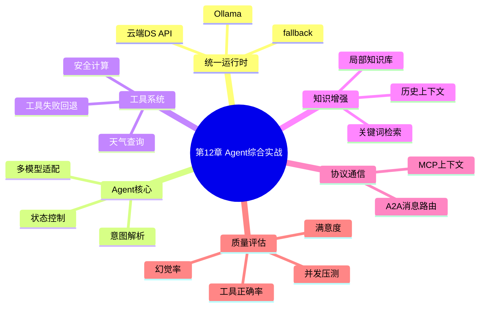
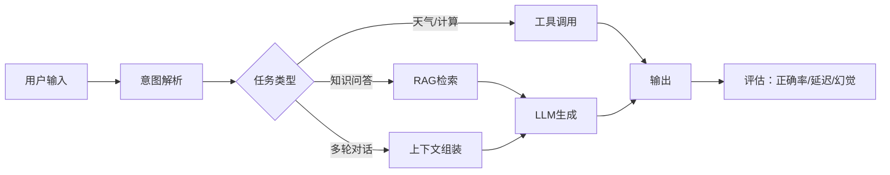
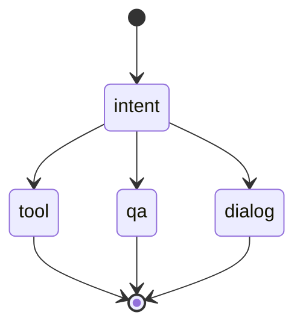
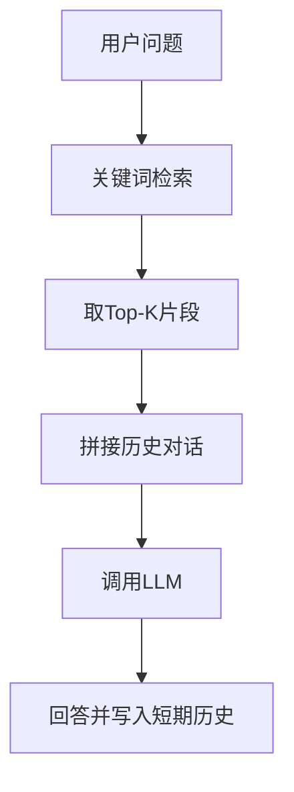

# 第12章：Agent 综合实战、协议化上下文与质量评估

本章把前面章节的能力串成一个“可工程化运行”的 Agent 小体系：统一模型后端、意图识别、工具链、状态控制、轻量 RAG、MCP 上下文、A2A 消息、综合工具记忆、工具调用评估、并发压测和幻觉评估。

当前 `src` 下的示例已经完成重构：

- 支持本地 Ollama，例如 `qwen3:1.7b`、`gemma4:e2b-mlx`
- 支持云端 DeepSeek/OpenAI 兼容 API，通过项目根目录 `utils.py` 调用
- 所有持久化数据统一写入 `ch12/data`
- 每个脚本都有 `main()` 入口，可以直接运行测试
- 模型不可用时默认启用教学 fallback，保证示例离线也能跑通

本章没有修改任何 `main.py`，所有可运行示例都在 `src` 目录。

## 文件地图

| 文件 | 主题 | 核心知识点 |
| --- | --- | --- |
| `src/ch12_runtime.py` | 公共运行时 | `ask_llm`、`ask_with_context`、Ollama/云端 API、局部 data 路径、fallback |
| `src/12_1_model_adapter_context.py` | 多模型适配器 | 统一上下文、主备模型、对话历史传递 |
| `src/12_2_intent_parser.py` | 意图解析 | LLM 结构化解析、规则 fallback、参数抽取 |
| `src/12_3_tool_chain_fallback.py` | 工具链与兜底 | 天气工具、计算工具、异常后回退模型 |
| `src/12_4_agent_state_controller.py` | Agent 状态控制 | intent/tool/qa/dialog 状态分发与快照 |
| `src/12_5_lightweight_rag_subsystem.py` | 轻量 RAG | 局部知识库、关键词检索、历史上下文 |
| `src/12_6_mcp_context_router.py` | MCP 上下文路由 | 消息协议、上下文历史、按意图路由 |
| `src/12_7_a2a_message_router.py` | A2A 消息路由 | Agent 间消息、工具 Agent、问答 Agent |
| `src/12_8_integrated_agent_tools_memory.py` | 综合 Agent | 工具调用、简单记忆、规则优先 |
| `src/12_9_tool_call_accuracy_eval.py` | 工具调用评估 | 测试集、期望工具、正确率 |
| `src/12_10_concurrent_load_test.py` | 并发压测 | `ThreadPoolExecutor`、QPS、平均响应时间 |
| `src/12_11_hallucination_satisfaction_eval.py` | 幻觉与满意度评估 | 参考答案、相似度、疑似幻觉率、满意度 |

## 统一后端

所有模型调用统一经过 `ch12_runtime.ask_llm()` 或 `ch12_runtime.ask_with_context()`：

```python
from ch12_runtime import ask_llm, ask_with_context, backend_name
```



本地 Ollama 运行：

```bash
cd /Users/dustchen/workdir/dev_agents/projects/agent-getstarted-python
LOCAL_LLM_BACKEND=ollama OLLAMA_MODEL=qwen3:1.7b python3 ch12/src/12_5_lightweight_rag_subsystem.py
```

云端 DeepSeek/OpenAI 兼容 API 运行：

```bash
cd /Users/dustchen/workdir/dev_agents/projects/agent-getstarted-python
python3 ch12/src/12_1_model_adapter_context.py
```

关闭 fallback，让模型失败直接抛错：

```bash
CH12_LLM_FALLBACK=0 python3 ch12/src/12_11_hallucination_satisfaction_eval.py
```

## 局部数据目录

本章所有持久化文件统一写入：

```text
/Users/dustchen/workdir/dev_agents/projects/agent-getstarted-python/ch12/data
```

当前会生成：

```text
ch12/data/ai_knowledge.txt
```

这样做的好处是每章示例的数据互不污染，也不会再散落到全局目录或项目根目录。

## 知识结构



## 总体流程



## 例12-1：多模型适配器与统一上下文

文件：`src/12_1_model_adapter_context.py`

这个示例展示如何把对话历史封装为统一上下文，再交给不同模型适配器调用。以前代码里常见的问题是每个模型的消息格式、异常处理、温度参数都散在脚本里；现在统一交给 `ch12_runtime`。

运行：

```bash
LOCAL_LLM_BACKEND=ollama OLLAMA_MODEL=qwen3:1.7b python3 ch12/src/12_1_model_adapter_context.py
```

## 例12-2：意图解析

文件：`src/12_2_intent_parser.py`

这个示例先尝试让 LLM 输出结构化意图，如果模型不可用或输出不稳定，就用规则 fallback：

```python
{
    "intent": "查询",
    "domain": "天气",
    "parameters": {"city": "上海"}
}
```

运行：

```bash
python3 ch12/src/12_2_intent_parser.py
```

## 例12-3：工具链与 fallback

文件：`src/12_3_tool_chain_fallback.py`

优先调用确定性工具：

- 天气：`query_weather(city)`
- 计算：`safe_eval(expression)`

工具无法处理时，再把原始问题交给模型回答。这个模式适合真实 Agent：能确定的任务交给工具，开放式任务交给模型。

运行：

```bash
LOCAL_LLM_BACKEND=ollama OLLAMA_MODEL=qwen3:1.7b python3 ch12/src/12_3_tool_chain_fallback.py
```

## 例12-4：Agent 状态控制

文件：`src/12_4_agent_state_controller.py`

用一个小型状态机把任务分到不同处理函数：



运行：

```bash
python3 ch12/src/12_4_agent_state_controller.py
```

## 例12-5：轻量 RAG 子系统

文件：`src/12_5_lightweight_rag_subsystem.py`

知识库路径：

```text
ch12/data/ai_knowledge.txt
```

流程：



运行：

```bash
LOCAL_LLM_BACKEND=ollama OLLAMA_MODEL=qwen3:1.7b python3 ch12/src/12_5_lightweight_rag_subsystem.py
```

这条命令已经在本地验证通过，Ollama 能返回真实回答。

## 例12-6：MCP 上下文路由

文件：`src/12_6_mcp_context_router.py`

MCP 的核心不是“又一个聊天格式”，而是把消息历史、调用类型、会话 ID 这些上下文显式打包，让路由器可以根据上下文判断下一步是问答、工具调用还是普通对话。

运行：

```bash
python3 ch12/src/12_6_mcp_context_router.py
```

## 例12-7：A2A 消息路由

文件：`src/12_7_a2a_message_router.py`

A2A 关注 Agent 与 Agent 之间的消息传递。本示例把消息分给两个 Agent：

- `ToolAgent`：处理“分析/工具/执行”类任务
- `AnswerAgent`：处理普通知识问答

运行：

```bash
LOCAL_LLM_BACKEND=ollama OLLAMA_MODEL=qwen3:1.7b python3 ch12/src/12_7_a2a_message_router.py
```

## 例12-8：综合工具与记忆 Agent

文件：`src/12_8_integrated_agent_tools_memory.py`

这个脚本把天气、乘法和短期记忆整合在一起。规则能处理的任务会直接走工具，所以速度很快；规则不能处理时返回可控兜底。

运行：

```bash
python3 ch12/src/12_8_integrated_agent_tools_memory.py
```

## 例12-9：工具调用正确率评估

文件：`src/12_9_tool_call_accuracy_eval.py`

测试思路：


运行：

```bash
python3 ch12/src/12_9_tool_call_accuracy_eval.py
```

本地测试结果：`6/6 = 1.00`。

## 例12-10：并发压测

文件：`src/12_10_concurrent_load_test.py`

这个示例用 `ThreadPoolExecutor` 模拟多用户请求，输出：

- 总请求数
- 成功响应数
- 平均响应时间
- QPS
- 部分请求详情

运行：

```bash
python3 ch12/src/12_10_concurrent_load_test.py
```

在当前测试环境中，云端 API 不可访问时会走 fallback，脚本仍能完成统计。

## 例12-11：幻觉率与满意度评估

文件：`src/12_11_hallucination_satisfaction_eval.py`

这个评估是教学版，不是严谨学术指标。它用参考答案和生成答案做字符串相似度，给出：

- 疑似幻觉数
- 疑似幻觉率
- 模拟满意度

运行：

```bash
LOCAL_LLM_BACKEND=ollama OLLAMA_MODEL=qwen3:1.7b python3 ch12/src/12_11_hallucination_satisfaction_eval.py
```

真实项目里建议把这个脚本升级为：

- 人工标注的评测集
- 事实核查工具
- 多模型裁判
- 引用来源校验
- 分类指标：事实错误、遗漏、答非所问、格式错误

## 本地 Ollama 与云端 DS API

本地 Ollama 适合本章大部分示例：

```bash
ollama list
LOCAL_LLM_BACKEND=ollama OLLAMA_MODEL=qwen3:1.7b python3 ch12/src/12_5_lightweight_rag_subsystem.py
```

如果用 `gemma4:e2b-mlx`，回答质量通常更好，但延迟和内存占用也会更高：

```bash
LOCAL_LLM_BACKEND=ollama OLLAMA_MODEL=gemma4:e2b-mlx python3 ch12/src/12_1_model_adapter_context.py
```

云端 DS API 走项目根目录 `utils.py`。如果 `.env` 和 API key 配好，可以直接：

```bash
python3 ch12/src/12_1_model_adapter_context.py
```

## Mac 与 Colab 建议

本章脚本本身不再强依赖本地 CUDA、Transformers 或 PyTorch。你的 Mac M3 + 24GB 内存更适合：

- 用 Ollama 跑 `qwen3:1.7b` 做快速验证
- 用 `gemma4:e2b-mlx` 做质量更好的本地推理
- 避免在本地直接跑大型 Transformers 训练或微调

如果后续要做 GPU 微调或大模型直接加载，建议放到 Colab：

```python
!pip install -U transformers accelerate torch

from transformers import AutoTokenizer, AutoModelForCausalLM
import torch

model_id = "Qwen/Qwen3-1.7B"
tokenizer = AutoTokenizer.from_pretrained(model_id)
model = AutoModelForCausalLM.from_pretrained(
    model_id,
    device_map="auto",
    dtype=torch.float16,
)
```

## 测试命令

语法检查：

```bash
cd /Users/dustchen/workdir/dev_agents/projects/agent-getstarted-python
python3 -m py_compile ch12/src/*.py
```

批量运行：

```bash
python3 ch12/src/12_1_model_adapter_context.py
python3 ch12/src/12_2_intent_parser.py
python3 ch12/src/12_3_tool_chain_fallback.py
python3 ch12/src/12_4_agent_state_controller.py
python3 ch12/src/12_5_lightweight_rag_subsystem.py
python3 ch12/src/12_6_mcp_context_router.py
python3 ch12/src/12_7_a2a_message_router.py
python3 ch12/src/12_8_integrated_agent_tools_memory.py
python3 ch12/src/12_9_tool_call_accuracy_eval.py
python3 ch12/src/12_10_concurrent_load_test.py
python3 ch12/src/12_11_hallucination_satisfaction_eval.py
```

## 踩坑记录

- 不要用旧文件名 `12-1.py` 这类脚本名做模块导入，连字符不是合法 Python 模块名；现在已重命名为 `12_1_...py`。
- 不要在脚本里直接写全局数据路径，本章统一使用 `ch12_runtime.data_path()`。
- 云端 API 在无网络、API key 缺失或沙箱限制下会失败；默认 fallback 是为了保证教学脚本能跑通，不代表真实模型质量。
- Ollama 有时会返回较慢，尤其是长 prompt 或大模型；可以先用 `qwen3:1.7b` 验证流程，再换 `gemma4:e2b-mlx` 看效果。
- 幻觉评估里的相似度规则很粗糙，只适合教学演示；真实评估要结合人工标注、事实来源和多维指标。
