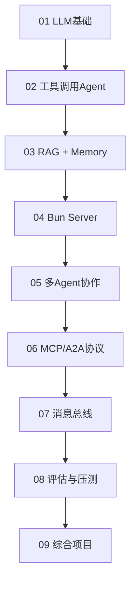
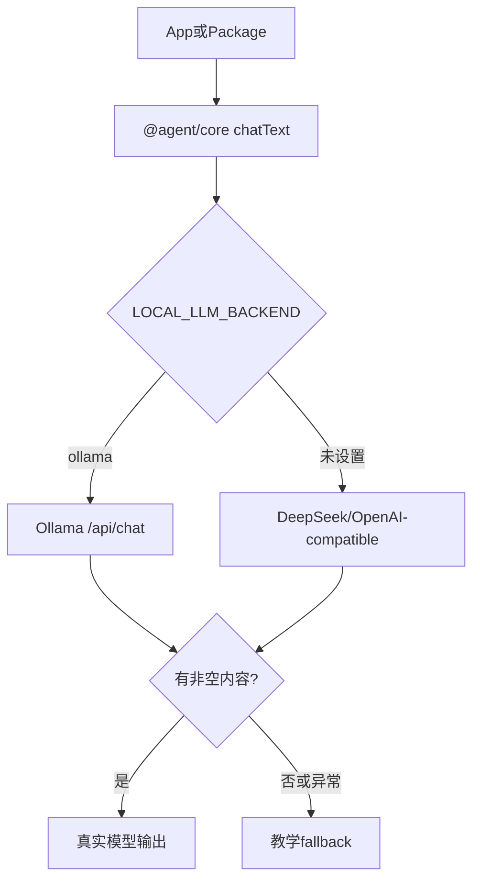

# Agent Get Started TypeScript

这是 `agent-getstarted-python` 的 TypeScript/Bun 版本，但不再按原 Python 章节一比一复制，而是按功能模块由浅入深组织为 monorepo。

设计目标：

- 单一职责：LLM、工具、RAG、记忆、协议、服务、评估分别独立成包
- 开放封闭：新增模型后端、工具、检索器、记忆存储时，尽量扩展新模块，而不是改动业务 app
- 本地优先：支持 Ollama，本地可跑 `qwen3:1.7b`、`gemma4:e2b-mlx`
- 云端兼容：支持 DeepSeek/OpenAI-compatible Chat Completions API
- 教学友好：模型不可用时默认 fallback，保证流程可以跑通

## 项目结构

```text
agent-getstarted-typescript/
  packages/
    core/         # LLM后端、Agent抽象、公共类型、路径/env
    tools/        # 计算器、天气、HTML摘要等工具
    rag/          # 文本切片、关键词检索、简单RAG Agent
    memory/       # 窗口记忆、JSONL持久化记忆
    protocols/    # MCP-like上下文、A2A消息
    server/       # Bun原生API、Fastify、鉴权、日志、限流、队列
    evals/        # 工具正确率、幻觉粗评估、压测
  apps/
    01-llm-basics/
    02-agent-tools/
    03-rag-memory-agent/
    04-agent-server/
    05-multi-agent/
    06-protocol-agents/
    07-redis-agents/
    08-agent-evals/
    09-integrated-demo/
  tests/
  data/
  docker/
```

## 能力路线



## 公共 LLM 后端

所有 app 都通过 `@agent/core` 的 `chatText()` / `chatMessages()` 调模型。



本地 Ollama：

```bash
LOCAL_LLM_BACKEND=ollama OLLAMA_MODEL=qwen3:1.7b bun run demo:llm
```

云端 DeepSeek/OpenAI-compatible：

```bash
bun run demo:llm
```

关闭 fallback：

```bash
AGENT_TS_LLM_FALLBACK=0 bun run demo:llm
```

## 环境变量

复制 `.env.example` 后填写：

```bash
cp .env.example .env
```

常用配置：

```text
LOCAL_LLM_BACKEND=ollama
OLLAMA_MODEL=qwen3:1.7b
OLLAMA_BASE_URL=http://127.0.0.1:11434

DEEPSEEK_MODEL_ID=deepseek-chat
DEEPSEEK_API_KEY=
DEEPSEEK_BASE_URL=https://api.deepseek.com

AGENT_TS_LLM_FALLBACK=1
AGENT_TS_SERVER_PORT=3020
AGENT_TS_FASTIFY_PORT=3090
AGENT_TS_API_TOKEN=dev-token
REDIS_URL=redis://127.0.0.1:6379
REDIS_CHANNEL_PREFIX=agent-ts
SQLITE_MEMORY_PATH=
```

## 安装与检查

```bash
cd /Users/dustchen/workdir/dev_agents/projects/agent-getstarted-typescript
bun install
bun run check
bun test
```

当前测试覆盖：

- LLM fallback
- 工具路由与计算器
- HTML摘要
- RAG切片与检索
- 窗口记忆
- MCP/A2A消息结构
- Agent Registry 与内存消息总线
- OpenAI-compatible handler
- 限流器、异步任务队列、SSE stream
- Fastify 鉴权与请求日志
- BM25、向量检索、混合检索
- SQLite memory
- 幻觉粗评估
- 并发压测 runner

## 运行示例

### 01 LLM 基础

```bash
bun run demo:llm
LOCAL_LLM_BACKEND=ollama OLLAMA_MODEL=qwen3:1.7b bun run demo:llm
LOCAL_LLM_BACKEND=ollama OLLAMA_MODEL=gemma4:e2b-mlx bun run demo:llm
```

对应文件：

```text
apps/01-llm-basics/src/index.ts
```

### 02 工具 Agent

```bash
bun run demo:tools
LOCAL_LLM_BACKEND=ollama OLLAMA_MODEL=qwen3:1.7b bun run demo:tools
LOCAL_LLM_BACKEND=ollama OLLAMA_MODEL=gemma4:e2b-mlx bun run demo:tools
```

能力：

- 天气工具优先处理天气问题
- 计算器工具优先处理四则运算
- 工具无法处理时回退到 LLM
- 输出工具路由正确率

对应文件：

```text
apps/02-agent-tools/src/index.ts
```

### 03 RAG + Memory Agent

```bash
bun run demo:rag
LOCAL_LLM_BACKEND=ollama OLLAMA_MODEL=qwen3:1.7b bun run demo:rag
LOCAL_LLM_BACKEND=ollama OLLAMA_MODEL=gemma4:e2b-mlx bun run demo:rag
```

能力：

- 简单知识库
- 关键词检索
- 窗口记忆
- JSONL 持久化记忆

持久化路径：

```text
data/memory/rag-agent.jsonl
```

### 04 Bun 原生 Server

启动：

```bash
bun run dev:server
LOCAL_LLM_BACKEND=ollama OLLAMA_MODEL=gemma4:e2b-mlx bun run dev:server
```

健康检查：

```bash
curl http://127.0.0.1:3020/health
```

OpenAI-compatible Chat：

```bash
# 限定 token
curl -X POST http://127.0.0.1:3020/v1/chat/completions \
  -H "Content-Type: application/json" \
  -d '{"messages":[{"role":"user","content":"你好，介绍一下你自己"}],"max_tokens":120}'
curl -X POST http://127.0.0.1:3020/v1/chat/completions \
-H "Content-Type: application/json" \
-d '{"messages":[{"role":"user","content":"你好，介绍一下你自己"}]}'

# 流式输出
curl -N -X POST http://127.0.0.1:3020/v1/chat/completions \
  -H "Content-Type: application/json" \
  -d '{"messages":[{"role":"user","content":"你好，介绍一下你自己"}],"stream":true}'
```

本服务使用 Bun 原生 `Bun.serve`，没有使用 Express。

`@agent/server` 还提供了可复用的工程化组件：

- `FixedWindowRateLimiter`
- `AsyncTaskQueue`
- `textEventStream`
- `createFastifyAgentServer`

### 05 多 Agent 协作

```bash
bun run demo:multi
LOCAL_LLM_BACKEND=ollama OLLAMA_MODEL=qwen3:1.7b bun run demo:multi
LOCAL_LLM_BACKEND=ollama OLLAMA_MODEL=gemma4:e2b-mlx bun run demo:multi
```

能力：

- Planner / Researcher / Writer 三个角色 Agent
- 通过 `WindowMemory` 传递协作上下文
- 每个 Agent 只承担一个职责

对应文件：

```text
apps/05-multi-agent/src/index.ts
```

### 06 MCP/A2A 协议化 Agent

```bash
bun run demo:protocols
LOCAL_LLM_BACKEND=ollama OLLAMA_MODEL=qwen3:1.7b bun run demo:protocols
LOCAL_LLM_BACKEND=ollama OLLAMA_MODEL=gemma4:e2b-mlx bun run demo:protocols
```

能力：

- `AgentRegistry` 注册 Agent 能力
- `A2AMessage` 作为 Agent 间消息信封
- `McpContext` 把会话消息和 metadata 显式封装
- `InMemoryMessageBus` 演示发布订阅

对应文件：

```text
apps/06-protocol-agents/src/index.ts
```

### 07 消息总线 Agent

```bash
bun run demo:bus
LOCAL_LLM_BACKEND=ollama OLLAMA_MODEL=qwen3:1.7b bun run demo:bus
LOCAL_LLM_BACKEND=ollama OLLAMA_MODEL=gemma4:e2b-mlx bun run demo:bus
docker compose -f docker/docker-compose.redis.yml up -d
```

能力：

- 优先连接 Redis pub/sub
- Redis 不可用时自动回退到内存消息总线
- 消息接口与基础设施实现解耦

对应文件：

```text
apps/07-redis-agents/src/index.ts
```

### 08 Agent 评估与压测

```bash
bun run demo:evals
LOCAL_LLM_BACKEND=ollama OLLAMA_MODEL=qwen3:1.7b bun run demo:evals
LOCAL_LLM_BACKEND=ollama OLLAMA_MODEL=gemma4:e2b-mlx bun run demo:evals
```

能力：

- 工具路由正确率
- 幻觉粗评估
- 并发压测
- QPS / 平均响应时间统计

对应文件：

```text
apps/08-agent-evals/src/index.ts
```

### 09 综合 Demo

```bash
docker compose -f docker/docker-compose.redis.yml up -d
AGENT_TS_API_TOKEN=dev-token bun run demo:integrated
LOCAL_LLM_BACKEND=ollama OLLAMA_MODEL=qwen3:1.7b AGENT_TS_API_TOKEN=dev-token bun run demo:integrated
LOCAL_LLM_BACKEND=ollama OLLAMA_MODEL=gemma4:e2b-mlx AGENT_TS_API_TOKEN=dev-token bun run demo:integrated
```

接口：

```bash
curl http://127.0.0.1:3090/health
curl -X POST http://127.0.0.1:3090/chat \
  -H "Authorization: Bearer dev-token" \
  -H "Content-Type: application/json" \
  -d '{"sessionId":"demo-1","message":"请解释一下什么是RAG"}'
curl http://127.0.0.1:3090/memory/demo-1 -H "Authorization: Bearer dev-token"
curl http://127.0.0.1:3090/registry -H "Authorization: Bearer dev-token"
```

能力：

- Fastify 服务端
- Bearer Token 鉴权
- 请求日志
- Tool 路由
- Hybrid RAG
- SQLite 持久化记忆
- Redis 会话记忆
- Redis / InMemory A2A 消息总线

对应文件：

```text
apps/09-integrated-demo/src/index.ts
```

## Docker / Redis

当前代码对 Redis 是增强依赖而不是硬依赖。`@agent/protocols` 里的 `MessageBus` 是接口：

- `InMemoryMessageBus`：无需基础设施，适合本地教学与单进程 demo
- `RedisMessageBus`：真正连接 Redis pub/sub，适合多进程 / 多实例 Agent

本地验证时使用：

已经预留 Redis compose：

```bash
docker compose -f docker/docker-compose.redis.yml up -d
docker compose -f docker/docker-compose.redis.yml down
```

当前 compose 使用镜像：

```text
redis:8.8.0-trixie
```

## 模块职责

| 模块 | 职责 |
| --- | --- |
| `@agent/core` | env、路径、LLM后端、Agent抽象、公共类型 |
| `@agent/tools` | 天气、计算器、HTML摘要等确定性工具 |
| `@agent/rag` | chunk、keyword、BM25、vector、hybrid、SimpleRagAgent |
| `@agent/memory` | WindowMemory、JsonlMemory、SqliteMemory、RedisMemory |
| `@agent/protocols` | A2A、MCP、AgentRegistry、InMemoryMessageBus、RedisMessageBus |
| `@agent/server` | Bun API、Fastify API、鉴权、请求日志、限流、任务队列、SSE stream |
| `@agent/evals` | 工具正确率、幻觉粗评估、并发压测 |

## 后续扩展计划

下一阶段建议继续增强：

- PostgreSQL memory / audit log
- MongoDB document memory
- 真正的 embedding provider
- 多租户 auth / session 隔离
- 流式综合聊天接口

## 已验证

本地已通过：

```bash
bun run check
bun test
bun run demo:llm
bun run demo:tools
bun run demo:rag
bun run demo:multi
bun run demo:protocols
bun run demo:bus
bun run demo:evals
bun run demo:integrated
LOCAL_LLM_BACKEND=ollama OLLAMA_MODEL=qwen3:1.7b bun run demo:llm
```

Bun / Fastify server 已验证：

```text
GET /health
POST /v1/chat/completions
POST /chat
GET /memory/:sessionId
GET /registry
```
